# Pikul

> **See what a new “yes” will cost before you give it.**

Pikul helps Malaysian university students understand the cost of an incoming commitment before they accept it. It compares the commitments they already carry with **their own usual pattern**, previews the affected week, and leaves the final decision with them.

**Team:** Thong Shuheng · Lim Wey Cheng · Ku Kian Xiang
**Prototype:** [pikul-codenection-2026.vercel.app](https://pikul-codenection-2026.vercel.app) · **Repository:** [github.com/shuheng0330/Pikul](https://github.com/shuheng0330/Pikul)

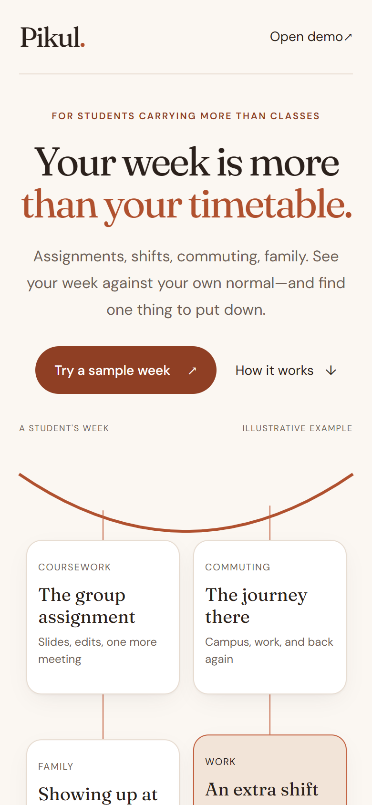

[Problem](#the-problem) · [How it works](#price-the-yes) · [Ideation](#ideation-and-process) · [Prototype](#design-and-interactive-prototype) · [Differentiation](#what-makes-pikul-different) · [Feasibility](#technical-feasibility) · [Limits](#method-safeguards-and-limitations) · [Impact](#impact-and-next-steps)

## The problem

University students can be carrying coursework, a part-time shift, travel, family obligations, and club or social plans at the same time. Malaysian research reflects this mix: [a UUM study](https://journal.unisza.edu.my/apj/index.php/apj/article/view/104) identified academic, social, and environmental factors as important sources of student stress, while [a UKM study of part-time students](https://www.researchgate.net/publication/354082340_Pekerjaan_Sambilan_dan_Prestasi_Akademik_Mahasiswa_Kajian_dalam_Kalangan_Pelajar_Universiti_Kebangsaan_Malaysia_Part-Time_Work_and_Students'_Academic_Performance_A_Study_among_Students_at_University_K/citations) found that balancing time and academic responsibilities matters when working during university. These studies support the broader context, while the specific situations that shaped Pikul came from our team’s observations and discussions. The recurring problem was not simply “I am busy”; it was **not knowing whether one more request will make an already-heavy week unreasonable until after saying yes**.

The direct users are Malaysian university students, particularly those balancing study with paid work, commuting, family responsibilities, or student activities. Other stakeholders include peers asking for cover, employers and club organisers who need a response, and student-support staff who want students to make informed choices without being judged by a single universal capacity score.

Students already use calendars and task lists. Google Calendar lets people create events and tasks with a start time and planned duration, while Todoist’s Upcoming view helps people organise dated tasks and can show calendar events alongside them. [Google Calendar’s task guide](https://support.google.com/calendar/answer/9901136?hl=en) and [Todoist’s calendar integration guide](https://www.todoist.com/help/todoist/integrations/use-the-calendar-integration-rCqwLCt3G) describe those scheduling capabilities. They are useful records of **when** work happens; Pikul addresses the different, request-time question: *given my own recent pattern and the other things I carry, what would this extra yes cost?*

## Price the Yes

Pikul is a workload-decision prototype, not another task list. It turns an incoming request into an editable draft, prices it against the week where it would land, and supports a deliberate answer.

1. See whether the current week is lighter than, around, or heavier than the student’s own usual pattern.
2. Open an incoming request that Pikul has read from a message; correct anything it misunderstood.
3. Preview the affected week before and after accepting the request.
4. Accept it, decline with a copyable reply, or consider handing back an eligible existing commitment.
5. Review the four weeks ahead, a quiet-day prompt, and a decision record.

### The same request, before and after

Without Pikul, a student may see only that an extra shift is free on Friday and answer before considering the assignment, commute, and other commitments around it. With Pikul, the same request is added only as a preview: the student sees how it changes the specific week, then chooses whether to say yes, decline, or make room. The app does not decide for them.

| Before Pikul | With Pikul |
|---|---|
| A request arrives in a message. | The request is read into editable details. |
| The student checks one time slot or relies on instinct. | Pikul compares the week that request enters with the student’s own usual. |
| The combined cost becomes clear later. | The before/after consequence is visible while the answer can still change. |

## Ideation and process

### Mapping the problem

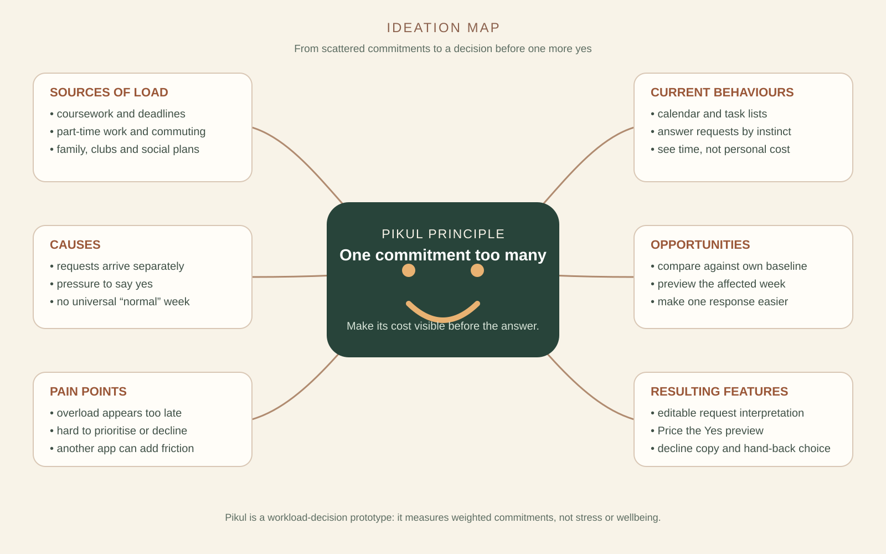

The team began with a broad question about student workload, then narrowed it to the decision moment. The map shows why a generic dashboard was not enough: a student needs context when an additional commitment enters an already-full week, not only a retrospective summary.

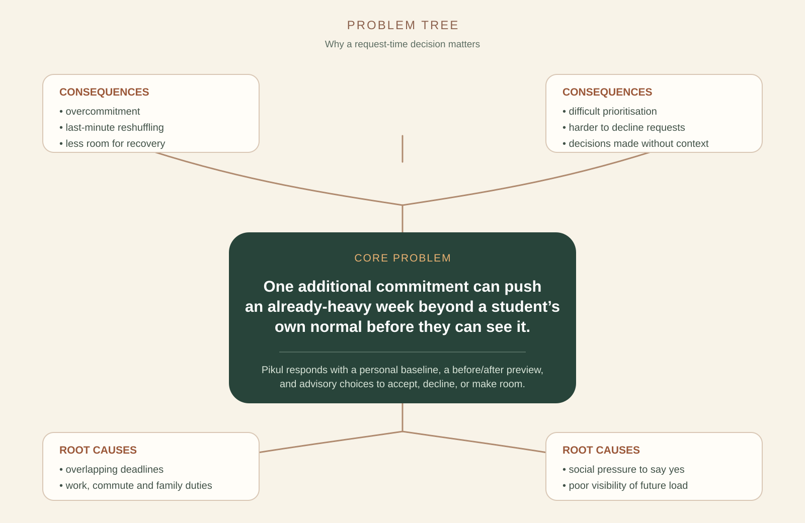

The problem tree led to four product decisions: compare with a personal baseline rather than an invented universal capacity, show the affected week before and after, offer advice rather than a verdict, and protect essential commitments from hand-back suggestions.

### Directions we genuinely considered

| Direction | Need addressed | What we learned | Decision | Why |
|---|---|---|---|---|
| **Personal-baseline workload manager** | Different students have different normal weeks. | One universal threshold would be hard to defend. | **Kept** | Compare each student with their own pattern. |
| **“Price the Yes” request flow** | Students need help before accepting, not only after overload is visible. | The decision moment is more useful than a passive dashboard. | **Kept** | Preview a specific incoming commitment in its landing week. |
| General workload or stress dashboard | Make workload visible. | It was too reactive and too similar to existing productivity views. | Evolved | Its context remains, but now supports a preventive decision. |
| Detailed manual request entry | Capture request details accurately. | Asking busy students to fill another long form created friction. | Reduced | Begin with a pasted message and keep every interpreted field editable. |
| Google Calendar, LMS, and message integrations | Reduce manual input. | Valuable, but needs accounts, permissions, privacy design, and integration work. | Deferred | A future extension, not a claim about this prototype. |
| Generic AI chatbot | Provide support. | A generic chat response did not improve the decision. | Not prioritised | Future AI should reduce friction or compare scenarios, not merely chat. |
| Agentic scenario optimisation | Compare full, partial, declined, or rearranged options. | Promising, but too broad to build and validate in this prototype. | Future direction | Could later recommend transparent alternatives with explicit user approval. |

### Evolution from dashboard to decision support

| Stage/date | Earlier direction | Evidence or concern | Result in the prototype |
|---|---|---|---|
| V1 · 7 Sep | Workload dashboard | Too reactive: it explains a heavy week after it fills. | A dashboard remains as context, not the final interaction. |
| V2 · 7–8 Sep | Personal baseline | Students can have different normal weeks. | The main signal compares a student with their own usual pattern. |
| V3 · 7 Sep, 23:39 | “Price the Yes” | The useful moment is before accepting a request. | Incoming commitments are previewed against their landing week. |
| V4 · 8 Sep | Detailed request entry | Manual classification adds work for an already-busy student. | A sample message is interpreted first; details stay editable. |
| V5 · 8–9 Sep | Quick, low-friction check | A decision often happens in seconds. | One request sheet, a clear cost, and accept/decline choices. |
| V6 · 9 Sep | Calendar/LMS/message imports | Existing commitments should eventually arrive with less manual work. | Explicitly deferred; the demo remains browser-only and local. |
| V7 · 10 Sep | AI/agentic alternatives | Future support could compare partial acceptance or moving commitments. | A later research direction, not an implemented feature. |

### Mentor consultation and validation status

**Mentor consultation is scheduled for 12 September 2026. No mentor feedback is claimed in this README before that session.**

Our current evidence is implementation and release QA, not external student validation. While refining the prototype, the team found and corrected a forecast chart with invisible bars, a sheet that could be painted behind page content, and a low-contrast carry-bar track. Keyboard focus, cancellation, repeated decisions, responsive layouts, and wording against actual behaviour were then added to the automated release check. A future campus pilot should test whether students understand and trust the personal-baseline comparison.

## Design and interactive prototype

Pikul’s visual system uses warm paper-like surfaces, dark high-contrast type, rounded cards, and rust/gold accents to make a sensitive workload conversation feel calm rather than clinical. The desktop layout uses a persistent navigation rail and contextual panels; the mobile layout keeps the primary decision close to the thumb and uses a bottom navigation bar. The implementation includes `prefers-reduced-motion` handling.

### 1. Landing — explain the premise before asking for data


Four commitments hang from one line because they are experienced as one person carrying them, not as separate apps. This is explicitly an illustration, not a claim about the viewer’s data.

### 2. Today — compare a week with its owner’s usual

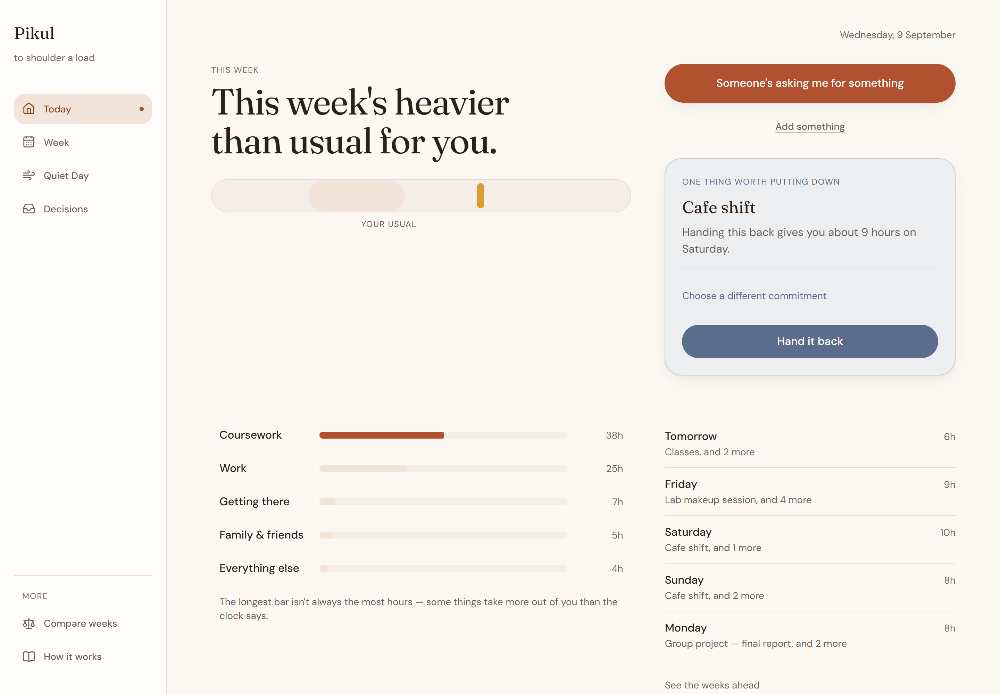

The marker and shaded “your usual” range are deliberately not a score. Area bars show weighted load while the nearby figures remain plain hours: equal time can take different effort.

### 3. Request interpretation — start from the message that arrived

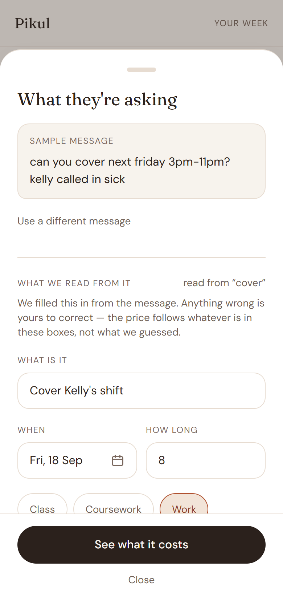

Pikul reads the sample message first, identifies what it can, and lets the student correct the draft. The preview follows the edited fields, not an opaque guess.

### 4. Decision forecast — price the affected week, not a generic average

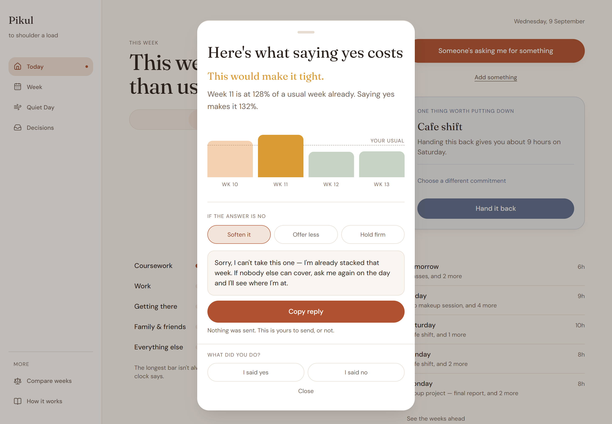

The before figure matters: the incoming request may add pressure without being the only reason a week is hard. Declining exposes a drafted reply in three tones; sending it is always the student’s choice.

### 5. Hand-back choice — advice with control

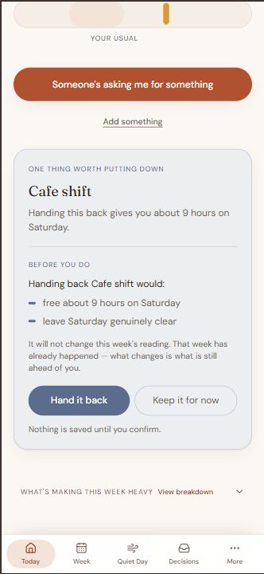

After an eligible commitment is chosen, Pikul explains what handing it back would change before anything is saved. The student can confirm or keep it; classes, coursework, commuting, and family responsibilities are never offered.

### 6. Weeks ahead — see the commitments that are already coming

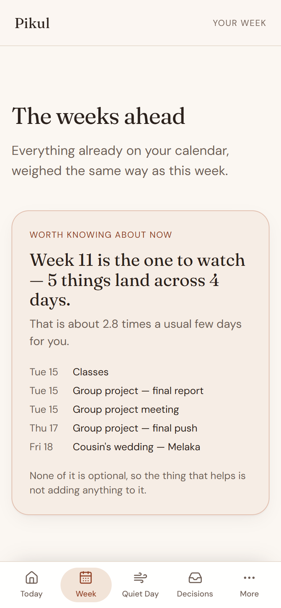

The forward view totals commitments already recorded; it does not predict how the student will feel.

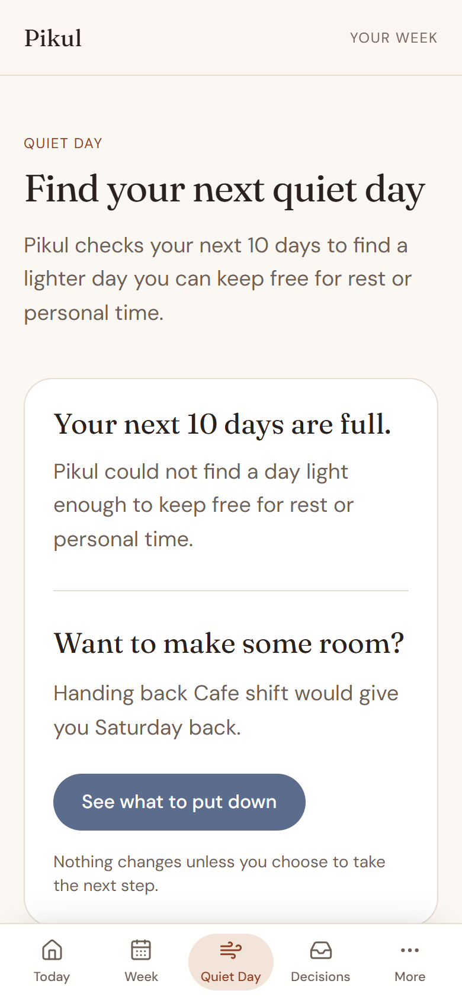

Quiet Day identifies a comparatively calm day in the next ten when one exists. This captured state shows the honest alternative: the next ten days are full, so Pikul does not invent a recovery slot and instead points back to the optional hand-back flow. It records nothing and never checks whether a suggestion was followed.

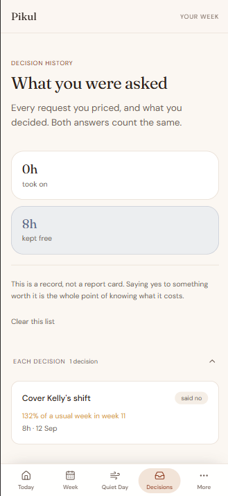

The Decisions route records accepted hours and hours kept free once a request has been priced. This state shows one declined request without turning the history into a score or report card.

## What makes Pikul different

The central twist is simple: Pikul makes the cost of a new commitment visible **at the moment the student must answer**, relative to their own pattern rather than a universal ideal.

| Capability | Google Calendar / Todoist | Pikul |
|---|---|---|
| Primary unit | Events and tasks | A decision about an incoming commitment |
| Week context | Scheduled time and dated tasks | Weighted commitments compared with the student’s own usual |
| Before accepting a specific request | Manual inspection of the calendar or list | Editable request plus a before/after view of its landing week |
| Responding to pressure | Scheduling and task organisation | Copyable decline wording, optional acceptance, or an advisory hand-back choice |
| Data model in this prototype | Cloud-connected products | Browser-local demo data; no account or runtime network service |

Pikul’s implemented differentiators are its personal baseline, its request-cost preview, and its selectable hand-back flow. It is intentionally preventive rather than a wellbeing diagnosis, and it does not claim that a heavier week causes burnout or predicts how someone will feel.

## Technical feasibility

**Frozen source reference:** [`8080a6290dc0b2b667f1fa6b055ad6ee56504032`](https://github.com/shuheng0330/Pikul/commit/8080a6290dc0b2b667f1fa6b055ad6ee56504032) (11 September 2026). Vercel finished deploying that commit at 14:39 UTC, one minute after it landed on `main`. The deployment record itself sits behind our Vercel account, so the checkable evidence is the public one: every route above returns HTTP 200 signed out, and the commit link opens for anyone.

**Frozen release record:** `npm run verify` passed its voice gate, ESLint, **170 Vitest tests**, and production build. `npm run check:release` then passed the local production build across all seven routes at 320, 360, 390, 640, 768, 1024, and 1440px, including reflow, touch targets, keyboard dialog behaviour, repeatable decisions, invalid-input handling, and reversible hand-back selection.

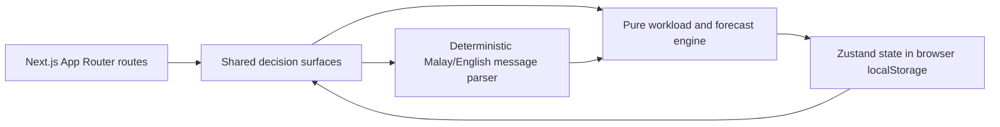

The prototype is a static Next.js 16 App Router frontend using React 19 and TypeScript. Zustand persists demo state to browser `localStorage`; `chrono-node` and `date-fns` handle deterministic parsing and dates; Motion supplies reduced-motion-aware transitions; Lucide React supplies icons. It is deployed on Vercel.

There is currently **no backend, database, account, API key, calendar connection, AI model, or runtime network service**. This is a deliberate scope choice: the team focused the available time on one complete, demonstrable decision loop rather than presenting unbuilt infrastructure as complete.

| Demonstrated now | Next validation or extension | Later, not promised |
|---|---|---|
| Seven connected routes, personal baseline, request preview, accept/decline, hand-back, four-week view, and recovery prompt | Campus pilot; a voluntary “did this feel heavier than usual?” check-in; timetable import after consent and privacy design | Multi-device sync, notifications, clinical claims, autonomous actions, social comparison, and prediction of wellbeing |

## Method, safeguards, and limitations

### What Pikul measures

Each commitment becomes a weighted load: its duration is multiplied by a fixed one-to-five effort dial. Recent and longer-term daily loads are calculated as exponentially weighted averages over 7 and 28 days, then compared. A ratio around 1.0 means the recent period resembles the student’s own established pattern; a new student with no history receives a neutral starting signal.

The arithmetic is inspired by session-RPE and athlete workload-monitoring literature, not validated student-health science. Foster described a simple training-load monitoring approach in 1998; [Foster (1998)](https://pubmed.ncbi.nlm.nih.gov/9662690/) is the source for that context. The team also acknowledges the substantial methodological critique of acute:chronic workload ratios, including [Impellizzeri et al. (2020)](https://pubmed.ncbi.nlm.nih.gov/32502973/). We use the calculation as a transparent design hypothesis for comparing committed workload—not as a causal or medical model.

### Boundaries that matter

- Pikul measures weighted commitments, **not self-reported stress**, burnout, mood, or health.
- It is not a diagnosis, medical advice, or a prediction of future wellbeing.
- The effort dial and transfer from sports science to student commitments are unvalidated design choices that need a campus pilot.
- Future views total commitments already recorded. They are not a forecast of how a person will feel.
- The demo uses generated personas and browser-local data, so the current baseline demonstrates the concept rather than measuring a real semester.
- Automated checks cover seven routes at seven viewport widths, horizontal overflow, touch-target size, keyboard behaviour in the request sheet, repeatable decisions, and local-state outcomes. A screen-reader pass, Android TalkBack, and physical-phone/mobile-data validation remain outstanding.

## Impact and next steps

Pikul’s immediate value is helping a student make a more informed decision about one incoming request. Its realistic first reach is a small campus pilot with student-support partners, where the team can ask whether the comparison is understandable, whether it changes the quality of decisions, and whether it preserves the feeling of user control.

The next product step is not an integration race. It is validating the personal-baseline hypothesis, then adding a carefully designed self-report check-in and consented timetable import only if they improve usefulness without creating surveillance or another burden. Longer-term scenario comparison could help students negotiate a partial shift or move a negotiable commitment, but it must remain explainable and explicitly approved by the user.

## Team contributions

| Member | Main responsibilities |
|---|---|
| **Thong Shuheng** | App shell, navigation and demo deep-links; Week, Quiet Day and Decisions framing; selectable hand-back; deployment and route QA; ideation, impact, and README integration. |
| **Lim Wey Cheng** | Landing-page story and visual system; decision preview; brand assets, motion, mobile presentation, and final README screenshots. |
| **Ku Kian Xiang** | Initial prototype and seven routes; workload engine, message parser and seeded weeks; decision reliability; automated release check; Today and Compare compositions; method, limitations, and technical README sections. |

## Run locally

Requires Node.js 20.9 or newer, which is what Next.js 16 itself requires; we build on 22. No environment variables are needed.

```bash
npm install
npm run dev
```

For the full pre-release suite:

```bash
npm run verify
npm run build && npm start
npm run check:release
```

`npm run check:release` needs an installed Chrome or Edge browser. The public prototype is available at [pikul-codenection-2026.vercel.app](https://pikul-codenection-2026.vercel.app), so judges do not need to run the project locally.
