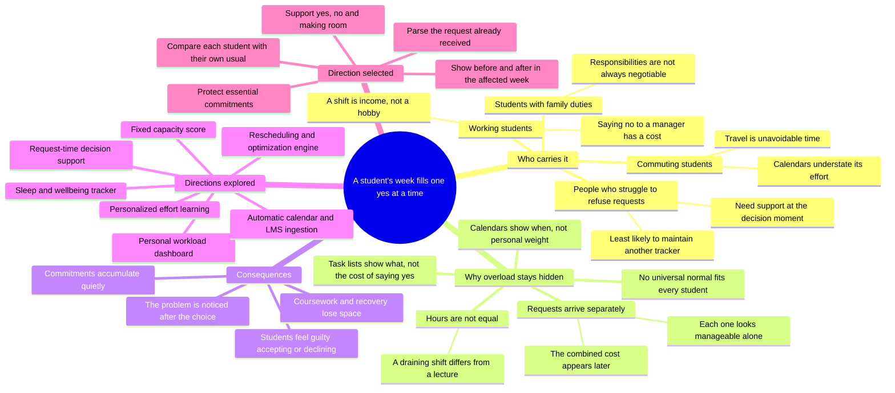
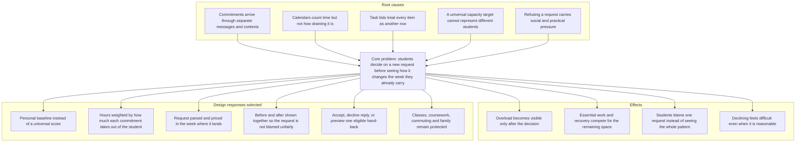

# README sections — Thong's draft

<!--
INTEGRATION NOTES — remove before copying into README.md.

This file covers Thong's assigned sections: submission links, ideation and
evolution, mentor/validation evidence, impact, roadmap, team contributions and
the final submission checklist.

Before publication, the team must still supply facts that are not recorded in
the repository:

1. the final unlisted video URL;
2. the final public slides/design URL, if one is used;
3. real mentor details and feedback, if a consultation occurred;
4. real student-test observations, if testing occurred;
5. the frozen main commit and its matching Vercel deployment;
6. each member's approval of the contribution table.

Do not replace these gaps with invented names, quotations, dates or results.
The public prototype URL below is recorded in deployment evidence, but it must
be checked again from a signed-out device after the final main deployment.
-->

# Pikul

**See what a new “yes” will cost before you give it.**

Pikul helps Malaysian university students compare upcoming commitments with
their own usual pattern, price a new request before accepting it, and make room
without treating essential responsibilities as disposable.

**Team:** Thong Shuheng · Lim Wey Cheng · Ku Kian Xiang

[Try the prototype](https://pikul-codenection-2026.vercel.app) ·
<!-- Replace before publication: [Watch the presentation](VIDEO_URL) · [View the slides/design](SLIDES_URL) -->

<!-- Lim inserts the final hero capture directly below this line. -->

## Ideation and process

Pikul did not begin as seven polished routes. We started with a smaller,
retrospective dashboard, challenged whether an already-overwhelmed student
would keep feeding it data, briefly explored a much larger product, and then
cut back to one testable decision loop. The diagrams and timeline below show
how the final direction emerged from those trade-offs.

### Mapping the problem before choosing features

The map led us away from a generic productivity dashboard. The common failure
point was not simply forgetting a task; it was agreeing to one more commitment
without seeing its combined cost. That made the incoming request—not the
calendar—the centre of the prototype.

### Problem tree: from causes to design responses

This tree exposed an important constraint: a tool can reduce decision friction
without pretending to know a student's maximum capacity. That is why Pikul
uses a personal baseline and descriptive bands rather than “90% capacity” or a
wellbeing score.

### Ideas considered

The selected product combines parts of several directions. “Dropped” does not
mean the idea had no value; it means it was a weaker fit for this preliminary
prototype or required evidence and infrastructure we did not yet have.

| Direction considered | Need it addressed | Decision | Why |
|---|---|---|---|
| **Personal-baseline request decision support** | Help a student understand a new request while the answer can still change | **Selected** | Combines the strongest insight—compare a student with their own usual—with an immediate, demonstrable decision moment |
| Retrospective two-page workload dashboard | Show what made the present week heavy | **Kept, then expanded** | Useful for awareness, but too passive on its own; Today became the starting context for a request, Week and a decision history |
| Nine-route preventive product with History and Start onboarding | Show past build-up, solve cold start and cover the full journey | **Reduced to seven routes** | The forward horizon mattered, but nine routes in one week was not credible; History and Start were cut so the core flow could be completed and tested |
| Fixed “percentage of capacity” | Give one instantly understandable number | **Dropped** | No defensible denominator defines 100% of a student, and a fixed score would be read as a judgement |
| Sleep debt as a capacity modifier | Represent the brief's physical dimension | **Dropped** | Self-reported sleep would be a stated input presented like a measurement and would pull Pikul toward a fitness tracker |
| Full rebalancing and scenario optimizer | Compare moving, grouping, shortening or declining commitments | **Deferred** | Strong long-term decision support, but the prototype only has evidence for pricing a request and handing back one eligible commitment |
| Automatic timetable, calendar, LMS and email ingestion | Remove the burden of manual entry | **Future direction** | Directly addresses adoption, but requires integrations, accounts, permissions and a privacy model beyond the frontend round |
| Personalized “how did it feel?” learning | Replace fixed effort weights with each student's experience | **Next validation step** | It could make the weighting genuinely personal, but collecting feedback without first validating the basic decision loop would add unfinished scope |
| Generic AI wellbeing chatbot | Offer encouragement or rest suggestions | **Rejected** | Advice without the student's actual commitments adds little decision value and risks making unsupported wellbeing claims |
| Agentic negotiation and partial alternatives | Suggest options such as covering only part of a shift and draft the response | **Future research** | Potentially distinctive, but it needs reliable schedule data, explicit permission and stronger safeguards before acting for a student |

### How the idea evolved

| Date | Earlier direction | What challenged it | Decision and visible result |
|---|---|---|---|
| **6 Sep** | A focused landing page and Today dashboard | A dashboard could explain the current week but did not prevent the next overload decision | Kept the personal-baseline engine and made the request decision the core loop |
| **8 Sep** | Two routes were considered sufficient | Re-reading the brief showed that prevention requires seeing what is ahead, not only what already happened | Explored nine routes, a forward horizon, recovery, history and onboarding |
| **8 Sep** | Nine-route expansion | Three students had one week and needed a reliable, judge-visible flow | Cut History and Start, settling on seven routes and four main navigation destinations |
| **8–9 Sep** | The request sheet asked the student to classify a request by type and weight | Those taps exposed our data model and delayed the first useful result | Rebuilt the sheet around the message already received; parsed fields are editable and marked as read or guessed |
| **9 Sep** | Separate pages and duplicated page headers | Direct links, mobile navigation, persona switching and reset behaviour needed to work consistently | Added one shared app shell while keeping the landing page outside the workspace |
| **9 Sep** | Passing unit tests was treated as sufficient release evidence | Rendering exposed an invisible forecast chart, overpainted sheets and a disappearing comparison track | Added browser-based route and interaction checks alongside unit, lint and build checks |
| **9–10 Sep** | Pikul selected one hand-back recommendation | A recommendation should support choice rather than behave like a verdict | Kept the safest high-weight recommendation as default and added “Choose a different commitment” for all eligible alternatives |
| **10 Sep** | The browser's native calendar handled request dates | It looked disconnected from the visual system and hid which days already carried commitments | Replaced it with an in-product keyboard-accessible date field that marks occupied days |
| **10 Sep** | Dense supporting content remained fully expanded on phones | Important summaries competed for limited vertical space | Added mobile disclosures while preserving the complete desktop views |
| **11 Sep** | Some navigation and labels assumed the user already understood the product | Final readability review found unclear wording and navigation cues | Clarified product copy, labels and navigation before documentation freeze |

The largest evolution was conceptual, not visual: Pikul changed from “show me
how heavy my week is” to “show me what this new yes does to the week I already
carry.” Later changes protected the same idea by reducing input friction,
making the calculation honest, and keeping the student's final choice open.

### Mentor consultation and feedback integration

<!--
TEAM INPUT REQUIRED. No mentor session is recorded in docs/evidence as of
11 September 2026. If a session happened, replace the row below with the real
date, mentor, specific feedback, team response, and visible product/README
change. If no session happened, do not imply otherwise.
-->

| Date | Mentor | Specific feedback | What we changed or deliberately kept | Evidence |
|---|---|---|---|---|
| **Team to confirm** | **Team to confirm** | **No consultation record is currently available in the repository** | Add only a real response supported by team notes | Link the resulting feature, diagram or explanation |

### Validation and what changed

The evidence currently recorded is implementation and release validation, not
a study with students. We separate those claims deliberately.

| Evidence | What was checked or observed | What changed because of it |
|---|---|---|
| Full-route browser review | Seven routes across compact, tablet and desktop widths; direct loads, responsive navigation and horizontal overflow | Enlarged small navigation targets and corrected responsive behaviour |
| Keyboard interaction review | Request and add sheets, Escape dismissal, focus return, repeated decisions and hand-back cancellation | Added focus containment, accurate clipboard failure feedback, atomic decisions and no-write cancel paths |
| Rendered-page inspection | The forecast bars were invisible, an open sheet could be painted over, and the comparison track disappeared into its card | Corrected chart sizing, portalled sheets above page stacking contexts, and restored track contrast |
| Repeated demo runs | The request flow was exercised repeatedly without clearing browser state | Prevented duplicate acceptance and kept decisions consistent with stored data |
| Copy and model accuracy review | “Kept free” had been confused with “handed back”; protected-category wording did not match the engine | Separated the two outcomes and added tests that compare product promises with the actual eligibility rules |

<!--
TEAM INPUT REQUIRED. If student testing occurred, add one short table here:

| Who (anonymous description) | Task/question | Observation | Change made |

Record patterns, not names or personal data. If no external student testing
occurred, state that limitation in the final README instead of calling team QA
“user validation”.
-->

## Impact

### The decision before and after Pikul

**Before:** a student receives a request such as an extra shift. A calendar can
show whether that time slot is open, and a task list can show unfinished work,
but neither combines the request with everything already carried or explains
whether the affected week is unusual for that student. The student answers the
message first and discovers the combined cost later.

**After:** Pikul reads the request, lets the student correct its interpretation,
and prices it inside the week where it would land. The student sees the week
before and after the request, then accepts knowingly, declines with usable
wording, or previews making room by handing back an eligible commitment. The
prototype does not decide what a student should do; it moves the consequence
into view while the choice is still available.

### Who benefits

The first target group is Malaysian university students whose weeks mix
coursework with part-time shifts, commuting, clubs, social plans and family
responsibilities. These commitments often live in different systems and carry
different social costs. A personal baseline matters because an ordinary week
for one student may be an unusually heavy week for another.

The same decision pattern could later support other groups with fragmented,
negotiable commitments—interns, early-career workers, caregivers or student
leaders—but the current prototype and generated personas do not validate those
groups. Expansion should follow evidence rather than a broad claim that Pikul
already works for everyone.

### What success would mean

Pikul should not be judged by how often users say no. A useful product would
help students correctly explain what changed, make a deliberate decision, and
feel that either answer remained theirs. The next evaluation should therefore
measure comprehension and decision confidence before measuring retention or
feature use.

## Roadmap and realistic reach

| Stage | What we would do | Evidence required before continuing |
|---|---|---|
| **Now — preliminary prototype** | Demonstrate the personal baseline, request parsing, before/after price, accept/decline, selectable hand-back, four-week view and local decision history | Reliable public build and a complete judge-visible flow |
| **Next — small campus validation** | Test with a small group of Malaysian undergraduates using their own schedules; add a lightweight weekly “did this feel heavier than usual?” check | Comprehension, perceived usefulness, false-alarm patterns and whether the personal ratio agrees with weekly self-report |
| **Then — reduce setup friction** | Import timetable or calendar data with explicit permission; let students review every imported commitment | A privacy model, consent design, deletion/export controls and evidence that importing saves more effort than it creates |
| **Later — richer decision support** | Compare moving, shortening, grouping, declining or partially accepting a request; personalize effort weights | Reliable personal data, explainable alternatives and safeguards that keep the student in control |
| **Possible rollout** | Begin with one campus or student-support partner, then evaluate other universities and groups | Pilot outcomes and support capacity, not assumed demand |

The architecture makes the current prototype inexpensive to demonstrate: it
uses browser storage and requires no account, database or paid runtime API.
Scaling beyond one device is a different product decision. It would require a
backend, identity, synchronization, security and governance work that we have
not presented as already complete.

## Team contributions

| Member | Primary contribution | Shared contribution |
|---|---|---|
| **Thong Shuheng** | Shared app shell and navigation; Week interaction; Recover, Asks and Method consistency; deployment and route QA; selectable hand-back choice; README ideation, impact and final integration | Integration review, accessibility/correctness fixes, release and submission checks |
| **Lim Wey Cheng** | Landing-page story and responsive visual system; request decision preview; brand icon and sharing metadata; entrance motion and mobile disclosures | Visual review, screenshots, design explanation and presentation assets |
| **Ku Kian Xiang** | Today and Compare experience; workload engine, parser and local decision state; request and hand-back correctness; custom date field; methodology, limitations and technical README sections | Integration review, test coverage, technical accuracy and interaction captions |

The team divided work by product surface so each area had a clear owner, then
cross-reviewed shared behaviour. Where two branches solved the same problem,
the team compared correctness and accessibility before choosing which version
to retain rather than counting both as separate work.

## Submission verification

<!-- Keep this checklist private until complete, or convert it into a short
public “Links and reproducibility” note. Do not publish unchecked boxes. -->

- [ ] Merge all approved work into `main` and record the frozen commit.
- [ ] Run the repository verification and browser release checks against that
      commit; record the exact current test count only after freeze.
- [ ] Confirm the stable Vercel URL serves the frozen `main` build.
- [ ] Open the deployment, GitHub repository, video and slides/design while
      signed out; check them again on a physical phone using mobile data.
- [ ] Confirm all seven routes and the reset/persona demo links open directly.
- [ ] Insert six final screenshots from the frozen deployment with descriptive
      alt text and interaction-focused captions.
- [ ] Replace or remove every private integration note and evidence placeholder.
- [ ] Include only mentor and student feedback that actually occurred.
- [ ] Confirm scientific and competitor claims link to checked sources.
- [ ] Check that “stress”, “prediction”, “capacity”, backend and AI claims match
      the implemented scope and limitations.
- [ ] Have all three members review the complete README and approve their
      contribution descriptions.
- [ ] Watch the final presentation from beginning to end and confirm it remains
      below five minutes.
- [ ] Save the submission confirmation after the team leader submits.
