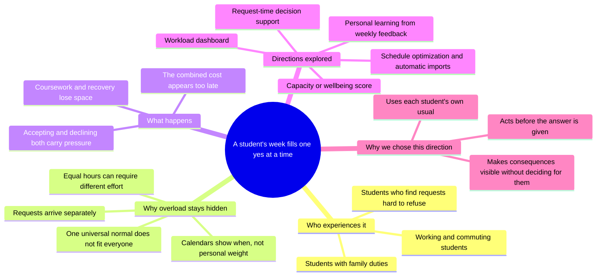
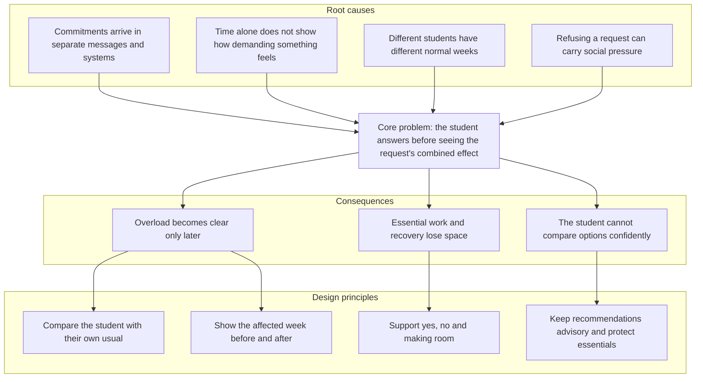

# README sections — Thong's draft V2

<!--
INTERNAL — remove before publishing.

Still waiting for team confirmation:
- final unlisted video URL;
- final public slides/design URL, if used;
- real mentor details and feedback, if a consultation occurred;
- real student-test observations, if testing occurred;
- frozen main commit and matching Vercel deployment;
- approval of the contribution table by all three members.

Never replace missing evidence with invented names, dates, quotes or results.
-->

# Pikul

**See what a new “yes” will cost before you give it.**

Pikul helps Malaysian university students compare upcoming commitments with
their own usual pattern, preview the effect of a new request, and make room
without treating essential responsibilities as disposable.

**Team:** Thong Shuheng · Lim Wey Cheng · Ku Kian Xiang

[Try the prototype](https://pikul-codenection-2026.vercel.app)
<!-- Add confirmed public video and slides/design links here. -->

<!-- Lim inserts the final hero image here. -->

## Ideation and process

Pikul's direction changed around one question: is it enough to show students
that a week is heavy after it has filled up?

Our first concept focused on awareness. The personal baseline made that view
more meaningful, but it was still retrospective. We therefore moved the useful
moment earlier—from reviewing the week to answering a new request.

> **Retrospective awareness → personal baseline → prevention → request-time
> decision → before/after preview → accept, decline or make room → advisory
> recommendation with user choice**

### Mapping the problem

The map led us away from a general productivity dashboard. The strongest
opportunity was not adding another place to store tasks; it was helping at the
moment one more commitment enters the week.

### Why those insights shaped the product

This reasoning is why Pikul uses a personal baseline rather than claiming to
know a student's maximum capacity. It supports a decision without turning the
student into a score.

### Ideas considered

| Idea | Need it addressed | Decision | Why |
|---|---|---|---|
| **Personal-baseline request support** | Understand a new request while the answer can still change | **Selected** | It combines personal context with a clear, useful decision moment |
| Retrospective workload dashboard | Explain why the current week feels heavy | **Combined** | Awareness was useful, but it became the context for prevention rather than the final product |
| Fixed capacity percentage | Give one simple number | **Dropped** | We could not defend one universal definition of 100% capacity |
| Sleep or wellbeing tracker | Include physical wellbeing | **Dropped** | It would require personal health inputs and risk unsupported wellbeing claims |
| Rebalancing and scenario optimizer | Compare moving, shortening or declining commitments | **Deferred** | Valuable, but too broad to build and test well in this round |
| Timetable, calendar and LMS imports | Reduce manual entry | **Future direction** | It needs accounts, permissions, integrations and stronger privacy safeguards |
| Personalized effort learning | Adapt weights using weekly feedback | **Next validation step** | Promising, but the basic decision model should be tested with students first |

### How Pikul evolved

| Stage | What we believed before | What challenged it | How the product changed |
|---|---|---|---|
| **Awareness → prevention** | A personal-baseline dashboard could explain a heavy week | Explanation after the fact could not prevent the next commitment | The incoming request became the centre of the experience |
| **Broad concept → focused prototype** | History, onboarding and several additional flows could show a complete system | Three students had one week to deliver a reliable prototype | We kept seven connected pages and cut History and onboarding |
| **Manual classification → message first** | Students could label each request before seeing its effect | Those questions added work and exposed our data structure | Pikul begins with the message received, shows what it understood and lets the student correct it |
| **Result → before and after** | Showing the final load was enough | A high result could unfairly make one request look like the whole problem | The affected week is shown both before and after the request |
| **Recommendation → supported choice** | Pikul could recommend one commitment to hand back | A recommendation risked feeling like a verdict | The default remains, but students can choose any other eligible commitment |
| **System language → student language** | Detailed labels and dense screens showed completeness | They slowed understanding, especially on phones | We simplified wording and layouts while keeping the full flow available |

The central change was from **“How heavy is my week?”** to **“What will this
new yes do to the week I already carry?”** Each later decision made that answer
faster to understand while preserving the student's control.

<!--
TEAM INPUT REQUIRED — MENTOR CONSULTATION

No mentor consultation is recorded in the repository as of 11 September 2026.
If a real session occurred, publish this section using only confirmed notes:

### Mentor consultation

| Date | Mentor | Feedback | Our response | Result |
|---|---|---|---|---|
| Confirm | Confirm | Specific feedback, not a generic summary | What changed or why we disagreed | Visible result |

If no consultation occurred, disclose that honestly instead of publishing this
template or implying that feedback was received.
-->

## Validation and what changed

The evidence below comes from our own implementation and release checks. It is
**not external student validation**, and we do not present it as such.

| What we checked | What we found | What improved |
|---|---|---|
| Responsive layouts | Some navigation targets were too small and dense content was difficult to scan on phones | Larger controls, clearer navigation and simpler mobile sections |
| Keyboard use and cancellation | Decision panels needed clearer focus behaviour and safer cancellation | Essential actions now work by keyboard, and cancelling does not change saved data |
| Visual clarity | Important charts or panels could be hidden or difficult to distinguish | Forecasts, overlays and comparison visuals were made consistently visible |
| Repeated decisions | Reopening or repeating a choice could create inconsistent history | Accepting, declining and handing back now produce one consistent result |
| Wording against behaviour | “Kept free” and “handed back” had been mixed up, and protection wording did not fully match the rules | Outcomes are now separated clearly and the visible promises match the product |

<!--
TEAM INPUT REQUIRED — STUDENT TESTING

If testing occurred, add only real observations in this form:

| Participant description | Task or question | Observation | Change made |
|---|---|---|---|

Record patterns, not names or personal data. If no external testing occurred,
state that limitation in the final README.
-->

## Impact

### The decision before and after Pikul

| Without Pikul | With Pikul |
|---|---|
| A new request arrives | The same request arrives |
| The student checks whether the time is free | Pikul shows the week where it would land |
| The commitment looks manageable on its own | The week is compared with the student's own usual |
| The student answers before seeing the combined effect | The student previews the week before and after |
| The cost becomes clear later | The student accepts, declines or makes room knowingly |

**Pikul does not decide for the student. It makes the consequence visible while
the choice is still theirs.**

### Who it is for

Our first users are Malaysian university students balancing coursework with
part-time work, commuting, clubs, social plans and family responsibilities.
These commitments often sit in different systems and carry different kinds of
pressure, which is why one fixed definition of a “normal week” is not enough.

The same idea may later help interns, early-career workers, caregivers or
student leaders. Those groups have not been validated by this prototype, so
they remain possible future users rather than part of our current claim.

### What success would mean

- Can students understand why a week is unusually heavy for them?
- Does the before-and-after preview help them respond more confidently?
- Do they still feel that the final choice is theirs?

We would test these questions before claiming that Pikul changes behaviour or
improves wellbeing.

## Roadmap and realistic reach

| Stage | Direction | What must be learned or built first |
|---|---|---|
| **Now** | Demonstrate the personal baseline, request preview, decision choices, hand-back and four-week view | A reliable public prototype and complete demo flow |
| **Next** | Run a small campus test and add a simple weekly “did this feel heavier than usual?” check | Evidence that students understand and trust the comparison |
| **Then** | Import timetable or calendar data with clear permission and review | Consent, privacy, deletion and data-control design |
| **Later** | Compare moving, shortening, grouping or partly accepting commitments; personalize effort weights | Reliable personal data and explainable recommendations |
| **Possible rollout** | Begin with one campus or student-support partner before expanding | Pilot results and realistic support capacity |

Today, Pikul works in one browser without an account, database or paid runtime
service. Multi-device syncing and real integrations would require a backend,
identity, security and governance work that are not part of this prototype.

## Team contributions

| Member | Main responsibilities |
|---|---|
| **Thong Shuheng** | App navigation; Week, Recover and Asks flows; deployment and route review; selectable hand-back choice; ideation, impact and final README integration |
| **Lim Wey Cheng** | Landing-page story and visual system; decision preview; brand assets, motion, mobile presentation and final screenshots |
| **Ku Kian Xiang** | Today and Compare flows; workload calculation and request interpretation; decision reliability; method, limitations and technical README sections |

All three members cross-reviewed integration, usability, accessibility and
release quality, then prepared the final submission together.

<!--
INTERNAL SUBMISSION CHECK — do not publish.

- Freeze and record the final main commit, test result and Vercel deployment.
- Add the confirmed video, slides/design and final screenshot links.
- Add only real mentor and student feedback, or disclose that it did not occur.
- Check every external link while signed out and on a physical phone.
- Remove every internal note and placeholder from the public README.
- Have all three members approve the complete README and contribution table.
- Confirm the final video remains below five minutes and save submission proof.
-->
