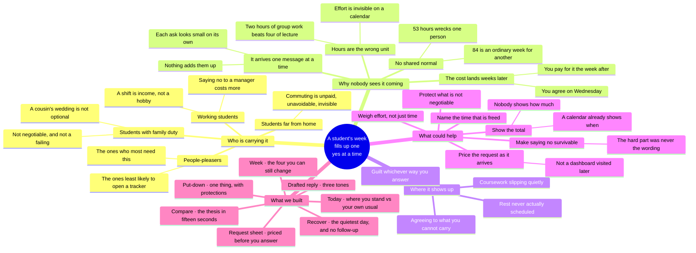

# Ideation inputs — Ku's contribution to §3

For Thong, who leads §3. This is raw material with sources, not finished README
prose — every row points at a file or a commit so you can check it rather than
take my word for it.

The rubric pays 25% for this section, more than any other, and its top bands
ask for specific things: *"Multiple documented iterations showing how and why
the idea evolved, including dropped directions"* (Iteration, 7%) and *"Several
distinct ideas generated and compared before choosing, with rationale"*
(Breadth, 3%). Everything below is dated and in git.

---

## 1. The evolution, with the reasoning that drove each turn

| # | Date | Where we were | What changed our mind | What we did | Where you can check |
|---|---|---|---|---|---|
| 1 | 6 Sep | **A two-page prototype.** `/` to explain, `/today` to demonstrate. The written position was blunt: *"More pages do not earn marks by themselves."* | — | Built the engine, the landing and Today first, before any second screen existed | `PLAN.md` §1; commit `fb32649` |
| 2 | 8 Sep | Proposed **nine routes, four tabs** | Re-reading the brief: its central verb is *preventive* — "before burnout hits", "until it's too late" — and our product was **entirely retrospective**. The forward horizon was not a nice-to-have, it was the gap. | Expanded scope, but capped navigation at four tabs | `EXPANSION_PLAN.md` §0 (retired; recoverable at `git show c11ea4a^:docs/EXPANSION_PLAN.md`) |
| 3 | 8 Sep | Settled on **seven routes** | Nine routes in a week, for three part-time students, was not a real plan | Dropped `/history` and `/start`; retired the expansion plan the same day it was written | `PHASE_PLAN.md`; commit `c11ea4a` |
| 4 | 8 Sep | The request sheet **asked you to classify the ask yourself** — pick one of four kinds, then light / medium / heavy | Watching it back: that is a question about *our data model*, not about anyone's life, and it costs two taps before you learn anything | Rebuilt it to open on a message that has already been parsed, every field marked *read* or *guessed* | `docs/evidence/2026-09-09-decision-contract.md` |
| 5 | 9 Sep | Considered **sleep debt as a capacity modifier** — the sharpest line we had written: *"Your week isn't heavier than usual. You are."* | It would have filled the brief's "physical" area. But self-reported sleep is a *stated* input, not a measurement, and adding body metrics turns us into a fitness tracker and loses the brief | Dropped | `EXPANSION_PLAN.md` §2.4 |
| 6 | 9 Sep | Scoped an optional **"how did it feel?" check-in** | It is the only thing that would make the intensity dial *yours* instead of ours — but the decision flow was not finished, and half of two features is worth less than one | Deferred, and recorded as the obvious next build | `docs/BRIEF_COVERAGE.md` |
| 7 | 10 Sep | Used the browser's native date input | Chrome paints that calendar itself; CSS cannot reach it. Next to warm paper it read as a piece of a different application, at the exact moment somebody is deciding something | Built our own, and used the opportunity to mark days that already carry something | `components/app/DateField.tsx`; `PROJECT_STATUS.md` |

## 2. Directions we considered and did not build

Each of these was written down and argued before it was cut. Naming them is
worth marks; pretending we never considered them is worth none.

| Idea | What it would have given us | Why it is not in the build |
|---|---|---|
| **`/history`** — twelve weeks behind, with the warm-up period drawn as a dashed line | The "it built up quietly" moment, and honesty about the EWMA start-up artefact (our own seed reads 1.57 / 1.90 / 1.45 in weeks 1–3, which is an artefact, not a crisis) | Backward-looking, and the brief's verb is preventive. Cut in favour of the forward horizon |
| **`/start`** — onboarding that solves the cold start by asking for your timetable | The genuinely good insight underneath it: *a footballer's baseline has to be observed over 28 days; a student's baseline is a published document* | Too much of the week for a screen the judge sees once. The idea survives as the top row of our "next" column |
| **Sleep debt as a capacity modifier** | The brief's "physical" area, and our sharpest sentence | A stated input dressed as a measurement, and one step from being a fitness tracker |
| **`/week/rebalance`** — group errands into one trip, push commitments to a later week | This is the brief's *literal* "load balancer" | We only ever built handing one thing back. This is the most defensible thing a judge can say we missed, and it is named as such in `BRIEF_COVERAGE.md` |
| **"You're at 90% capacity this week"** | The brief suggests it by name | A capacity percentage needs a denominator, and nobody has established what 100% of a student is. Any number would be invented and would then be read as a grade — the exact register this product avoids. Enforced by a build-time check |
| **Self-classification of asks** | Simpler to build than a parser | Asks the user to think in our schema. Replaced by parsing the message |

## 3. Where the idea actually came from

Worth stating plainly, because the rubric's Originality band rewards *"combines
existing ideas in a novel way"* and that is exactly what this is rather than
invention from nothing.

The load model is **not ours**. It is the acute-to-chronic workload ratio from
athlete monitoring, with session-RPE underneath it — Foster, Gabbett, and a
live methodological argument we cite in full including the objections. The
insight was not inventing a measure. It was noticing that **a student's week
has the same shape as a training load**: unlike activities, wildly different
intensities, and a person whose tolerance is only knowable relative to their
own recent history.

The second half is the part we have not found elsewhere: attaching that
measurement to **the moment somebody asks you for something**, rather than to a
dashboard you visit later.

## 4. A mindmap you can use or replace

The rubric's single largest sub-criterion is **Visual Diagram and Mindmaps, 8%**,
and its top band asks for *"rich, multi-layered mapping (mindmap + problem tree
or user-flow) that clearly illustrates the ideation process."* Nothing in the
repo answered that, so here is a first pass — Mermaid, so it renders on GitHub
straight from the README with no image file to manage, and anyone can edit it
without a design tool.

It is deliberately four layers deep and it puts *what we built* on the same
canvas as *why*, so a judge can trace a feature back to the problem it came
from. Replace it with something hand-drawn if you would rather; the point is
that the row stops scoring zero.

**Between this and the user-flow diagram in `docs/readme-sections-ku.md` §2,
that top band is covered** — the descriptor asks for a mindmap *plus* a problem
tree *or* a user flow, and the user flow is drawn and rendering.

## 5. What I cannot supply, and will not invent

**Mentor consultation (7% of the total) — I have no record of one.** There is
no mentor note in `docs/evidence/`, and I was not in a session. The handbook
says teams may book one mentorship slot of up to 25 minutes via the Google
Sheet, on Discord, first come first served. If one happened, whoever attended
should write it up. **If it did not, the rubric's own band for "no mentor
consulted" is 0–1, and the plan's rule against fabricating a mentor is
correct** — disclose it, and book one before submission if any slot remains.

**Tester observations — same position.** `PHASE_PLAN.md` scheduled a
first-impression check on Wednesday afternoon and a three-student flow test on
Thursday. No file in `docs/evidence/` records either. If those sessions
happened, they are worth real marks under Impact and Design and need writing
up today; if they did not, that is the cheapest marks still available before
the freeze — three students, fifteen minutes, written down honestly.
