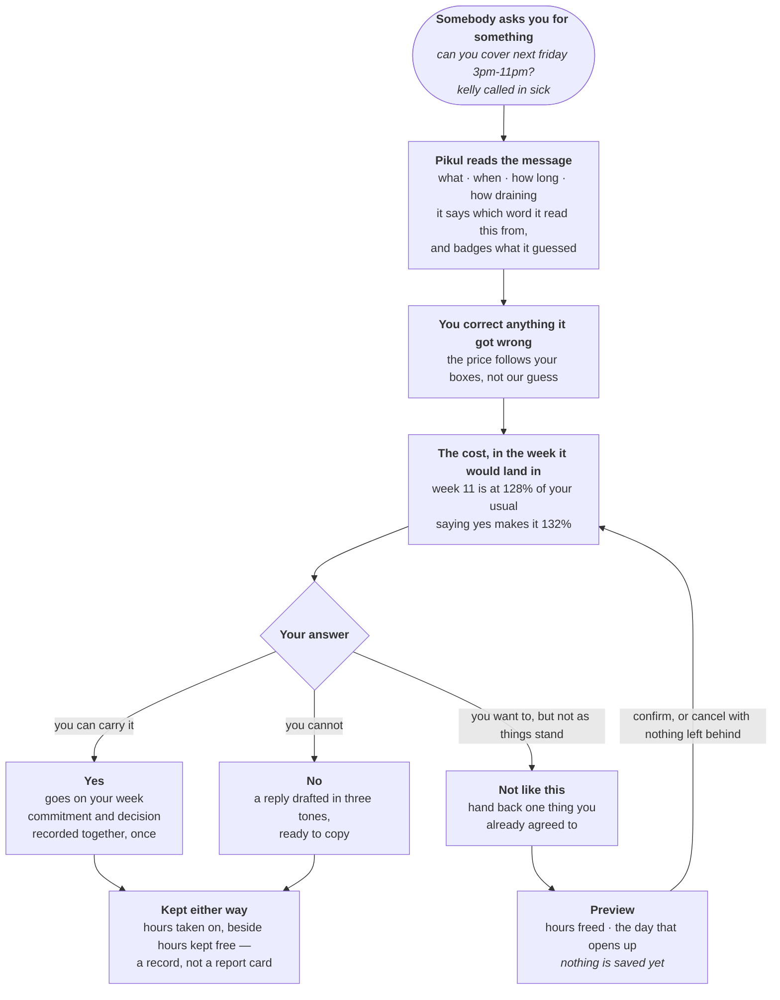
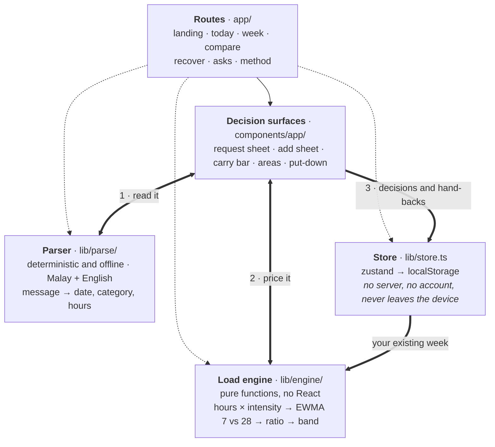

# README sections — Ku's draft

<!-- ==========================================================
     NOT FOR PUBLICATION — notes to the team. Everything above the
     next divider is scaffolding. Do not paste this into README.md.
     ========================================================== -->

For Thong to integrate. Per `docs/README_PLAN.md` I lead four sections — §2
solution and core loop, §5 what makes Pikul different, §6 architecture and
feasibility, §7 method and limitations — and supply the interaction captions
for §4 and the setup lines in §9. The two diagrams in here (user flow, and the
architecture one further down) are Mermaid, so GitHub renders them from the
README source with no image asset to manage.

Every figure comes out of the engine rather than being typed in by hand.

**Still needs a human before this ships.** The test count and commit must be
re-taken from the frozen build on Friday evening — they have moved four times
this week, and `README_PLAN.md` lists a stale count on its own guardrail list.
The accessibility paragraph must match the manual testing actually completed by
then. And the four competitor claims in §5 each carry a source link; re-check
they still say what I quoted before publishing.

<!-- ================= END NOT FOR PUBLICATION ================= -->

---

## What it does, in one Wednesday

Every figure here is computed by the engine rather than typed in by hand, and
nothing in this section is illustrative. One caveat worth stating up front:
the demo anchors itself to the Wednesday of whatever week you open it in, so
these figures are from **Wednesday 9 September 2026** and will move if you run
it later. Re-derive them from the frozen build before quoting them anywhere
else.

Aisyah is a student with a part-time café job. It is **Wednesday 9 September**,
and at 3pm a message arrives: *"can you cover next friday 3pm-11pm? kelly
called in sick"*.

**Without Pikul,** the question she can answer is "am I free on Friday the
18th?" Her calendar says yes — the shift is in the evening and nothing else is
booked in that slot. So she says yes, the way she has said yes to the last
four. She finds out what it cost her in the middle of the following week, by
which time the reply cannot be taken back and the assignment is already late.

**With Pikul,** the same message is read in place. From the word *cover* it
works out that this is a shift, on **Friday 18 September**, for **8 hours**,
of a kind that takes a lot out of her. A title is the one thing it cannot read
out of a sentence like that, so Pikul supplies one and marks it as a guess.
Anything it got wrong she corrects before a price is calculated — the number
follows her boxes, not our guess. One tap, and she sees the week the shift
would land in:

> **Week 11 is at 128% of a usual week already. Saying yes makes it 132%.**

That sentence is the whole product. It is not "you are at 90% capacity", which
would need a denominator nobody has established. It is Aisyah against Aisyah's
own previous four weeks, and it comes with the *before* figure as well as the
after — because 132% sounds severe until you know the week was at 128% before
anyone asked, at which point the honest reading is that **this request is not
what made the week hard**. Pikul says so rather than letting the number imply
otherwise.

Now she has three answers instead of one, and none of them is a guess:

- **Say yes** knowing the price. The shift goes on her week and the decision is
  recorded, once, together.
- **Say no** with a reply already drafted in three tones to copy. The hard part
  of saying no was never the wording.
- **Make room first** — hand back the café shift she already has on Saturday,
  which frees about 9 hours and genuinely clears that day, previewed before
  anything is saved and cancellable with nothing left behind.

The change is not that Pikul decided for her. It is that the decision moved
from *after* the consequence to *before* it, with the arithmetic visible on the
way past.

### The loop, end to end

*In words, for anyone reading without the diagram:* a request arrives and is
parsed in place; you correct anything it got wrong; it is priced against the
specific week it would land in; you answer yes, no, or *not as things stand*;
and whichever you choose is kept, with the hours you took on shown beside the
hours you kept free. Handing something back previews first and saves nothing
until you confirm.

### The rest of it

Open the app and the first thing Pikul does is tell you where you stand in one
sentence — *this week's heavier than usual for you* — with a marker sitting
against a shaded band that means "your usual". There is no score and no
percentage, because you can read a marker in half a second and a number invites
you to argue with it.

Underneath, the week is broken into five areas so you can see which part is
actually heavy. The bars are weight and the figures beside them are plain hours,
and those two disagree on purpose: an eight-hour shift and eight hours of
lectures are not the same week. Beside that sits the one thing worth putting
down, and the request button.

One tap gives you the cost, against the specific week the request would land in:
*week 11 is at 128% of a usual week already. Saying yes makes it 132%.* You get
the before figure as well as the after, because 132% sounds severe until you know
the week was already at 128% before anyone asked, at which point the honest
reading is that this request is not what made the week hard.

Then you answer. Saying no gives you a drafted reply in three tones to copy —
the hard part of saying no was never the wording, it was knowing you were
allowed to. Saying yes puts the commitment on your week and records the decision
together, once. Both answers are kept, and `/asks` shows the hours you took on
next to the hours you kept free, with a line making clear it is a record and not
a report card. A tool that only ever congratulates you for declining is just
another voice telling a people-pleaser what to do.

Handing something back is a separate action, and it previews before it commits:
the hours it frees, the day that would actually open up, and — the line we were
tempted to leave out — that it will not change this week's reading, because that
week has already happened. What changes is what is still ahead of you.

`/week` puts the same arithmetic across the four weeks in front of you, so you
can see the heavy one before you are in it. `/recover` finds the quietest day you
have coming and asks what you would do with it, then records nothing and never
checks. `/compare` is the argument in fifteen seconds: two students, and the one
carrying thirty-one fewer hours is the one in trouble.

## What makes it different

### The idea

Almost everything built for an overloaded student answers one of two
questions. *When is it?* — that is a calendar. *What is still outstanding?* —
that is a to-do list. Both are inventories. Both are answered by adding
another row, and neither one gets harder to answer as your week fills up.

Pikul answers a third question, and it only ever comes up at one moment:
**somebody is asking you for something right now — what will saying yes
actually cost you?**

Two ideas make that answerable, and it is the combination that is ours rather
than either half:

**A baseline that is yours.** Every figure Pikul shows compares you against
your own previous four weeks. Not against a target, not against a
recommended weekly maximum, not against another student. This matters more
than it sounds: a 53-hour week wrecks one student and is an ordinary Tuesday
for another, so any fixed threshold is wrong for nearly everybody it is
applied to. `/compare` exists to prove exactly this, and it is the fastest
argument in the product — two generated students, and **the one carrying 31
fewer hours is the one in trouble.** Wei Jian's 53 hours reads at 145% of his
own usual; Nurul's 84 reads at 129% of hers. He is further from his normal than
she is from hers, and the normal is the only thing that matters.

**Priced at the decision, not after it.** The measurement is attached to the
moment somebody asks. Pikul reads the message that arrived, prices it against
the specific week it would land in, and shows the before figure beside the
after one — while the answer is still yours to give.

Neither half is unprecedented on its own. Load ratios come from athlete
monitoring and we say so, at length, in the method. Message parsing is
ordinary. Putting them together so that the arithmetic runs *inside the
decision* — that is the part we have not seen anywhere else, and it is the
whole product.

### Three things it does that we have not seen elsewhere

**1. The price argues against itself.**

Every other tool that shows you a cost is trying to change your answer. Pikul
shows the before figure next to the after one specifically so the number
cannot mislead you:

> Week 11 is already at 128% of a usual week. Saying yes makes it 132%.

Four points. The honest reading is *this request is not what made your week
hard* — and Pikul says so rather than letting a scary-looking 132% imply the
opposite. A product that will talk you *out* of blaming the thing in front of
you is unusual, and it is the reason the figure can be trusted the next time
it is large.

**2. A recommender that refuses to recommend.**

The hand-back suggestion will never offer your classes, your coursework, your
commute or your family. Those are things you owe, not things you chose, and
telling a Malaysian student to skip a cousin's wedding is not advice, it is a
bug. Only shifts, social plans, club commitments and errands are ever on the
table.

And nothing under three hours is ever offered. If the only flexible things in
the week are small ones, Pikul says exactly that — *"handing them back
wouldn't buy you enough to feel"* — instead of producing a suggestion for the
sake of having one. Handing back ninety minutes of errands is busywork dressed
up as advice.

Two second-order decisions sit inside this one, and both look wrong until you
check them. Candidates are ranked by **weight — the hours times how much the
thing takes out of you** — and deliberately not by how far dropping one would
move the ratio, even though moving the ratio looks like the smarter measure.
Dropping a commitment shrinks the baseline as well as the week, so ranking by
ratio floats a two-hour badminton game above a nine-hour shift purely for
falling nearer the measuring date, and dropping the only social evening in a
heavy week can push the ratio *up*. What you are then shown is the plain hours
you get back, because that is the unit you actually feel.

The suggestion is also switched off entirely unless the week is already heavy.
Below a ratio of 1.3 the card says "Nothing needs to come off this week" and
offers nothing at all. A tool that always has something for you to drop is a
tool that has stopped paying attention.

**3. The build fails if the writing gets clinical.**

`npm run gate` scans everything under `app/` and `components/`, plus the two
files where our strings live, and fails `npm run verify` if a banned word
reaches a line a student could read. The engine's own vocabulary — the ratio,
its window names — is on the banned list, which is the point. It is not a linter we added for tidiness. Pikul's
entire thesis is *show the arithmetic to a judge, never to the user*, and with
three people writing interface copy in parallel that promise survives about a
day on discipline alone. Making it a build step is how a tone becomes a
guarantee instead of an intention.

Three smaller ones, all in the build: the request sheet opens on a message
that has **already been parsed**. The sheet says which word it read the
request from — *read from "cover"* — and badges anything it filled in itself
as *we guessed*. Every field is editable and the price follows your boxes, so
nothing has to be typed before you see a number. The parser handles Malay and English in the same sentence,
including the difference between *sabtu ni* and *sabtu depan*. And the date
picker marks the days that already carry something, so choosing when to put a
new commitment is not done blind.

### Against what students actually use

Compared on what each product says about itself, linked, as we read it in
September 2026. We can demonstrate the Pikul column in the build; the other
columns are our reading of someone else's, and where we could not confirm
something we have said so rather than writing "no".

**Start with the one that is genuinely close.**
[Bounds](https://withbounds.com/) describes itself as the first app built for
people-pleasing recovery. When a request lands it offers a guided pause before
you answer, gives you a script for that exact situation, and — this is the part
we independently arrived at too — treats a yes and a no as equally valid
outcomes rather than scoring you on declines. That is a real product solving a
real version of this problem, and pretending otherwise would be the easiest way
to lose a judge.

Here is the difference, and it is the whole of our claim: **Bounds helps you
say it. Pikul tells you what it costs.** It can hand you the words for no; it
cannot tell you that this particular Friday lands in a week already at 128% of
your usual, because it has no model of what you are carrying. The pause is
emotional; ours is arithmetic. A student who does not know whether they can
actually afford the shift is not helped by a better script.

| | [Bounds](https://withbounds.com/) | [Reclaim.ai](https://reclaim.ai/) | [Google Calendar](https://calendar.google.com/) | [Todoist](https://www.todoist.com/) | [Daylio](https://daylio.net/) | **Pikul** |
|---|---|---|---|---|---|---|
| What it is for | saying no without the guilt | arranging your time for you | when things are | what is outstanding | how you felt | **what a new yes will cost** |
| Knows what you are already carrying | not that we can find | your calendar's contents, and reports on where time went | your calendar's contents | your task list | the moods you logged | **a weighted total, against your own last 4 weeks** |
| Weighs effort, not just hours | no | priority levels | no | priority flags | no | **a 1–5 dial that scales the hours** |
| Prices a *specific* incoming request before you answer | not that we can find | not that we can find | no | no | no | **yes** |
| Helps you say no | **yes — scripts, and it is built for this** | no | no | no | no | yes — a drafted reply in three tones |
| Suggests what to put down, with protected categories | no | reschedules automatically | no | no | no | **yes** |
| Works with no account and no connected calendar | no | no | no | no | yes | **yes** |

Two honest readings of that table.

**Reclaim.ai** is the strongest tool here and it is solving the opposite
problem. It auto-schedules tasks, habits and breaks around what is already on
your Google or Outlook calendar, with priority levels, and reshuffles when
conflicts appear — it makes the work *fit*. It assumes the work is fixed and
the calendar is negotiable. Pikul assumes the reverse: the hours in a week are
fixed, the commitments are what you can still change, and the useful moment is
the one before you agree to another. It also needs a connected work calendar,
which is not where a student's shifts, family duties or group projects live.

**Daylio** is closest to us on caring how a week actually felt, and on keeping
data local — it stores entries on the device, with cloud backup as an option
the user turns on. But it is a record of what already happened: two taps, a
mood, some activity icons, reviewed later in charts. It asks how yesterday
went. Pikul asks what tomorrow will cost.

None of them, and no calendar or task list, answers *"if I say yes to this,
what happens to me?"* — which is the only question being asked at the moment
the message arrives.

## The method

The engine is one idea borrowed from sports science and one arithmetic trick,
and it is small enough to read in full in `lib/engine/acwr.ts`.

**Everything becomes one number.** A commitment's load is its hours multiplied by
how much it takes out of you, on a one-to-five dial that maps to `0.6, 0.85,
1.0, 1.3, 1.7`. This is session-RPE — duration times intensity — which is a
published and widely used way of making unlike activities comparable. It is why
a two-hour group meeting can outweigh a four-hour lecture, and why a shift, an
assignment and a weekend at home can be compared at all.

**Your recent self against your settled self.** Daily loads are totalled across
84 days, then run through two exponentially weighted moving averages over the
same series: a fast one with the smoothing factor for a 7-day window, and a slow
one with the factor for 28 days, using the standard `λ = 2 / (N + 1)`. The fast
average divided by the slow one is the only figure the app cares about. Above one
means this stretch is heavier than you usually carry. Weighted averages rather
than flat rolling means, because a flat mean lets a hard Tuesday drop out of the
window and vanish, and real load decays rather than falling off a cliff.

**The bands are deliberately wide.** Below 0.8 is lighter than usual, up to 1.1
is about usual, then 1.3, then 1.5. Note where the first edge sits: a perfectly
steady life computes to exactly 1.0, so 1.0 has to land inside "about your
usual". Telling someone whose weeks have not changed that they are carrying more
than usual would be a lie the first time they opened the app. With no history at
all the ratio is reported as a neutral 1.0 — a cold start is "we don't know you
yet", not "you have no load".

**"% of a usual week" is not hours divided by hours.** It is the weighted
ratio above, turned into a percentage. Aisyah's week holds 79 hours against a
usual 59, which is 135% by plain division — but the figure the app shows is
128%, because the ratio weighs each commitment by how much it takes out of you
and lets the recent past decay. If you check our arithmetic with a calculator
and a stopwatch, those are the two different sums. **Nothing is predicted.**
The weeks ahead use the identical function over commitments already in the
calendar. It is not a forecast of how you will feel.
It is what you have already agreed to, added up.

**Where it comes from.** The load model is not ours and we would rather say so
than be caught. Session-RPE — duration times intensity — is Foster's. The
acute-to-chronic ratio is what athlete monitoring built on top of it, and
Gabbett's 2016 paper is the one that made it widely used, and his suggested
band — 0.8 to 1.3 — is where our **outer** edges come from. That is not a
coincidence. We moved the inner edge to 1.1 for the reason above: a perfectly
steady life computes to exactly 1.0, and 1.0 has to land inside "about your
usual".

It is also **actively argued about in its own field** — the objection being
that the recent window sits inside the longer window it is divided by, which
can manufacture correlations that are not really there. Both the coupling
objection and a broader conceptual one apply to us. Rather than bury that here,
we put the full argument, with both sides, on **`/method` inside the product**,
reachable from every number the app shows. A judge or a student who wants to
attack the maths should find our own statement of the strongest case against it
waiting for them.

- Foster C. Monitoring training in athletes with reference to overtraining
  syndrome. *Med Sci Sports Exerc.* 1998;30(7):1164–8.
- Foster C, Florhaug JA, Franklin J, et al. A new approach to monitoring exercise
  training. *J Strength Cond Res.* 2001;15(1):109–15.
- Gabbett TJ. The training-injury prevention paradox: should athletes be training
  smarter and harder? *Br J Sports Med.* 2016;50(5):273–80.
- Lolli L, Batterham AM, Hawkins R, et al. Mathematical coupling causes spurious
  correlation within the conventional acute-to-chronic workload ratio
  calculations. *Br J Sports Med.* 2019;53(15):921–2.
- Impellizzeri FM, Tenan MS, Kempton T, Novak A, Coutts AJ. Acute:chronic
  workload ratio: conceptual issues and fundamental pitfalls. *Int J Sports
  Physiol Perform.* 2020;15(6):907–13.

## What it cannot do, and the test that would settle it

Four boundaries, stated once and stated plainly. The same list is inside the
product on `/method`, not only here.

**It does not track stress.** There is no self-report anywhere in Pikul — it
never asks how you feel and has no idea. It measures committed hours weighted
by a dial we chose. Calling that stress tracking would be a claim we cannot
support, so we do not make it, anywhere.

**It is not a diagnosis.** It notices a change in your own pattern. It cannot
tell you whether you are unwell, and it does not try.

**The dial is ours, and the transfer is a hypothesis.** Nobody has established
that a draining hour weighs exactly 1.7 ordinary ones, and applying an
athlete-monitoring model to coursework and family duty is our design decision.

**It only knows what it is told,** and it thinks in days rather than clock
times — so it will never tell you Thursday 3pm is free, and a month of history
has to exist before the comparison means much. That is why the demo ships with
generated weeks.

We would rather name the experiment than leave that hanging. **The smallest
thing that would settle it is a campus pilot:** thirty students, their real
timetables, four weeks, and one question at the end of each week — *was that
heavier than usual for you?* If the ratio agrees with the answer more often
than chance, the transfer holds. If it does not, the dial is wrong and we would
want to know that before anyone relies on it. That test needs no new
engineering; it needs the check-in in the "next" column above, and thirty
people.

On accessibility we claim exactly what we ran: `npm run check:release` verifies
seven routes at seven widths for reflow, flags any control that is under 44px
in *both* dimensions, and walks the request sheet from the keyboard. A screen-reader pass, Android
TalkBack and a physical-device check are **not** done, and are not claimed.

## Architecture

A single Next.js App Router frontend. No backend, no database, no account, no
API key, and no network call at runtime — verified, not asserted: there is no
`fetch`, no SDK and no `process.env` reference anywhere in `app/`, `components/`
or `lib/`. Your week lives in your own browser and nowhere else.

*Described in words, for anyone reading this without the diagram:* a request
message goes from the decision surfaces to the parser and comes back as a draft
with every field marked as read or guessed **(1)**. That draft plus the week
already in the store goes to the load engine and comes back as a before
percentage, an after percentage and a verdict **(2)**. Only an actual decision
— accept, decline or hand back — writes anything, and it writes the commitment
and the decision together, once **(3)**.

The dotted arrows are the honest part: a route can reach the parser, the
engine or the store directly without going through a decision surface —
`/compare` parses its own message, and the shell writes to the store to handle
`?reset=1` and `?persona=`. The solid path is the request flow; the dotted
ones are everything else. Two properties of that picture are the point of it.
**No arrow leaves the device.** And the engine has no path back into the
interface except through a return value, which is what lets 158 tests exercise
the arithmetic with no browser in sight.

    app/                    seven routes: /, /today, /week, /compare,
                            /recover, /asks, /method
    components/app/shell/   navigation, the page frame, demo deep-links
    components/app/         the decision surfaces — request sheet, add sheet,
                            carry bar, area breakdown, put-down
    components/landing/     the hero
    lib/engine/             the maths. Pure functions, no React, fully tested
    lib/parse/              message to draft commitment. Deterministic, offline
    lib/seed/              generated personas and the shared demo fixture
    lib/store.ts            the decision contract, persisted to localStorage
    lib/copy.ts             the interface strings
    lib/decline.ts          the drafted replies
    scripts/                the voice gate and the release check

Three decisions worth explaining:

**The engine is pure and separately tested.** `lib/engine` has no React import
and no knowledge of the screen. That is what makes 158 tests possible and it is
why the maths can be argued with independently of the interface.

**User-facing strings live in two files, by name.** `lib/copy.ts` holds the
interface, `lib/decline.ts` holds the twelve drafted replies. Not for
translation — for register. The engine thinks in acute-to-chronic ratios and the user must never
meet that vocabulary. `npm run gate` walks everything under `app/` and `components/` plus those two
files, and fails `npm run verify` if a banned word reaches a line a user could
read — the engine's own vocabulary is on that banned list, which is the point.
It is the only thing that keeps the voice intact with three people writing
interface copy in parallel.

**Parsing is deterministic, not a model.** Pattern matching and a date library,
running offline and instantly, with no API key to leak and no chance of
generating something unhinged in front of a judge. It handles Malay and English,
including the difference between *sabtu ni* and *sabtu depan*. Because the whole
parser is one function, a language model could replace that step alone later
without touching how load is calculated — which is the sensible division of
labour: language understanding where it helps, deterministic arithmetic where
consistency matters.

## Built, next, and not promised

The line between these three is the one we would most like a judge to hold us
to, because every column below is a claim of a different kind.

| Built and demonstrable today | Next, and what would have to be true first | Later, and deliberately not promised |
|---|---|---|
| Seven routes, working end to end with no account | **The "how did it feel?" check-in.** Scoped, then cut to finish the decision flow properly. It is the obvious next thing and the only way the intensity dial stops being ours and starts being yours. | Multi-device sync, which needs accounts, a backend and a privacy position we have not earned |
| A request priced against the specific week it lands in, before you answer | **Import a real timetable.** Everything today runs on generated weeks. Until a student's own semester goes in, the baseline is a demonstration rather than a measurement. | Notifications or anything that pings you — a tool for overloaded people should not add to the pile |
| Accept, decline with a drafted reply, or hand one thing back — all reversible | **Move a commitment instead of dropping it.** The brief's load balancer implies rescheduling; we only support handing back. | Predicting how you will feel. We total commitments; that is not the same thing and we will not blur it |
| Malay and English parsing, offline, deterministic | **Intensity learned per person** rather than a fixed five-point dial, which is what the check-in would unlock | Any clinical or diagnostic claim, at any point |
| Four-week horizon, put-down chooser, recovery prompt | **A campus pilot** — the smallest test that would tell us whether the ratio means anything for coursework | A marketplace, a social feed, or anything that turns a private week into a comparison with other people |

## What it cost to build, and what we chose not to do

Three final-year students, one week, alongside coursework — the repository's
first commit is 6 September and the deadline is the 13th. Nobody was full-time
on this.

That budget is the reason for the biggest technical decision in the project:
**no backend.** A week is not enough to build authentication, a database, a
hosting pipeline and calendar integrations *and* have any of them work under a
judge's hands. It is enough to build one thing that works completely. So we
spent the week on the decision flow and the arithmetic underneath it, and let
the absence of a server become a feature we can defend on its own terms —
nothing to breach, nothing to leak, nothing to pay for, and a student's week
that never leaves their phone.

What that costs us is stated plainly rather than hidden: your data does not
follow you to another device, and clearing your browser clears your history.
Those are real limitations of this build, not oversights, and the first column
of the table above is honest about which is which.

The three of us split by surface rather than by layer — decisions, landing,
and shell/navigation — with file ownership agreed up front, because three
people editing the same components for a week is how a hackathon repository
dies on the Friday. Where two lanes did build the same thing, the merge is
documented in `PROJECT_STATUS.md` with which version survived and why.

## Running it

Node 20.9 or newer — what Next 16 requires. We build on 22. No environment
variables and nothing to configure.

    npm install
    npm run dev          # http://localhost:3000

To check it the way we do before a release:

    npm run verify       # voice gate, lint, 158 tests, production build

    npm run build && npm start
    npm run check:release   # in a second terminal

`check:release` drives an installed Chrome or Edge and downloads no browser; set
`PIKUL_CHROME` if yours is somewhere unusual. It checks seven routes at seven
widths for horizontal overflow, flags controls under 44px in both dimensions,
walks the request sheet
from the keyboard, runs the demo five times with nothing cleared between runs,
and reads the decision and preview outcomes out of localStorage rather than off
the screen — so a screen that says the right thing over a store holding the
wrong thing still fails.

Useful demo links: `/today?reset=1` for a clean start, and
`/today?persona=nurul` or `?persona=weijian` to switch student. Full operator
path in `docs/DEMO_RUNBOOK.md`.

## Dependencies

Nine runtime packages, all of them load-bearing.

| | |
|---|---|
| `next`, `react`, `react-dom` | App Router frontend, statically rendered |
| `zustand` | client state, persisted to localStorage |
| `date-fns` | every *calendar* operation — month ends, week starts, weekday names. Three places do plain millisecond arithmetic to get a duration, which is a different job |
| `chrono-node` | natural-language dates in the message parser |
| `motion` | the transitions, all of which respect reduced motion |
| `d3-shape` | the curve on the landing hero |
| `lucide-react` | navigation icons |

Development adds TypeScript, ESLint, Tailwind CSS 4, Vitest, and
`puppeteer-core` for the release check. `puppeteer-core` deliberately rather than
`puppeteer`: it drives a browser you already have and downloads nothing.
