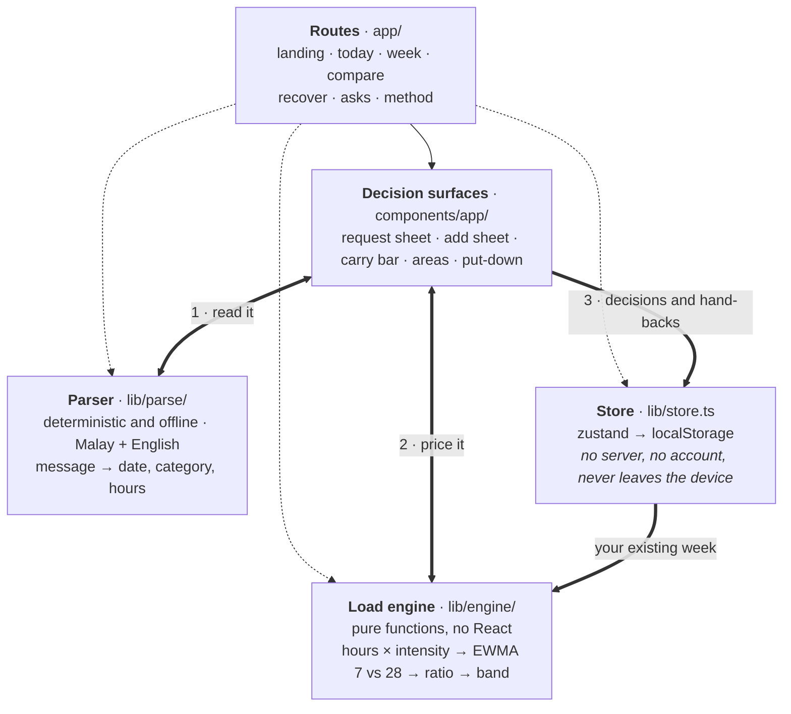

# README sections — Ku's draft

<!-- ==========================================================
     NOT FOR PUBLICATION - notes to the team. Everything above the
     next divider is scaffolding. Do not paste this into README.md.
     ========================================================== -->

For Thong to integrate. Per `docs/README_PLAN.md` I lead four sections - §2
solution and core loop, §5 what makes Pikul different, §6 architecture and
feasibility, §7 method and limitations - and supply the interaction captions
for §4 and the setup lines in §9, both now in `docs/readme-inputs-ku.md`.

**Restructured 11 September, on Thong's note** that too much evidence sat at
the same level of importance and that some of it read as engineering rather
than as English. Nothing was deleted. What a judge needs in order to score a
row is now the visible layer; the supporting depth sits in collapsible
`
` blocks that GitHub renders natively, one click away for whoever
wants to check us. The prose a judge has to read to score a row went from
5,960 words to 2,867; the supporting 2,252 sit in seven collapsed blocks. About
840 words of repetition went entirely - the 128%/132% explanation was made three
separate times. The two Mermaid diagrams stay open, since Presentation and
Design are scored on them.

Terms a student would not say - the ratio's real name, the averaging method,
the library names, the folder layout - now appear only inside the collapsed
blocks, where a technical judge is the one reading.

Every figure comes out of the calculation rather than being typed in by hand.

**Still needs a human before this ships.** The test count and commit must be
re-taken from the frozen build on Friday evening. The production commit on
record in `docs/evidence.md` is `4cfb5c7`, which `main` has moved well past —
re-deploy from the frozen commit and re-record it. The accessibility paragraph
must match the manual testing actually completed by then. And the four
competitor claims in §5 each carry a source link; re-check they still say what
I quoted before publishing.

<!-- ================= END NOT FOR PUBLICATION ================= -->

---

## What it does

Pikul measures your week against **your own** previous four weeks, and it puts
that measurement in front of you at the moment somebody asks you for something.
The request is read where it arrives, priced against the week it would actually
land in, and shown with the before figure beside the after one — while the
answer is still yours to give. You can say yes, say no with a reply already
drafted, or make room first by handing back something you already agreed to.
Every answer is kept, and none of them is scored.

### The loop, in five steps

1. **See where you stand** — this week and the four ahead, each against your own
   usual, as a marker on a band rather than a number out of ten.
2. **A request arrives and is read in place** — paste it, or open the one
   waiting. Pikul shows what it understood, field by field.
3. **See the cost, in the week it would land in** — the before figure and the
   after figure, together.
4. **Answer it** — yes; no, with a copyable reply in three tones; or make room
   by handing something back, previewed before anything is saved.
5. **See it kept** — the decision lands in your week and in a history showing
   hours taken on beside hours kept free.

### The same Wednesday, with and without Pikul

It is **Wednesday 9 September**. Aisyah has a part-time café job, and at 3pm a
message arrives: *"can you cover next friday 3pm-11pm? kelly called in sick"*.

**Without Pikul,** the only question she can answer is *am I free on Friday the
18th?* Her calendar says yes — the evening is empty. So she says yes, the way
she said yes to the last four. She finds out what it cost her the following
week, when the reply cannot be taken back and the assignment is already late.

**With Pikul,** the same message is read in place. From the word *cover* it
works out this is a shift, on **Friday 18 September**, for **8 hours**, of a
kind that takes a lot out of her. Anything it got wrong she corrects before a
price is calculated — the number follows her boxes, not our guess. One tap:

> **Week 11 is at 128% of a usual week already. Saying yes makes it 132%.**

That sentence is the whole product. It is not *"you are at 90% capacity"*, which
would need a limit nobody has established. It is Aisyah against Aisyah — and it
comes with the before figure, because 132% sounds alarming until you know the
week was at 128% before anyone asked. The honest reading is that **this request
is not what made the week hard**, and Pikul says so rather than letting the
number imply otherwise.

She now has three answers instead of one:

- **Say yes**, knowing the price.
- **Say no**, with a reply drafted in three tones to copy. The hard part of
  saying no was never the wording.
- **Make room first** — hand back Saturday's shift, which frees about 9 hours
  and genuinely clears that day, previewed before anything is saved.

The change is not that Pikul decided for her. It is that the decision moved from
*after* the consequence to *before* it.

### The same loop, drawn

*In words:* a request arrives and is read in place; you correct anything it got
wrong; it is priced against the week it would land in; you answer yes, no, or
*not as things stand*; and whichever you choose is kept, with the hours you took
on shown beside the hours you kept free.

<b>The rest of the app, screen by screen</b>

Open Pikul and the first thing it does is tell you where you stand in one
sentence — *this week's heavier than usual for you* — with a marker sitting
against a shaded band that means "your usual". No score and no percentage,
because you can read a marker in half a second and a number invites you to argue
with it.

Underneath, the week is broken into five areas so you can see which part is
actually heavy. The bars are weight and the figures beside them are plain hours,
and those two disagree on purpose: an eight-hour shift and eight hours of
lectures are not the same week.

Saying no gives you a drafted reply in three tones to copy — the hard part of
saying no was never the wording, it was knowing you were allowed to. **Decisions**
shows the hours you took on next to the hours you kept free, with a line making
clear it is a record and not a report card. A tool that only ever congratulates
you for declining is just another voice telling a people-pleaser what to do.

Handing something back previews before it commits: the hours it frees, the day
that would open up, and — the line we were tempted to leave out — that it will
not change this week's reading, because that week has already happened. What
changes is what is still ahead of you.

**Weeks** puts the same arithmetic across the four weeks in front of you, so you
can see the heavy one before you are in it. **Quiet Day** finds the quietest day
you have coming and asks what you would do with it, then records nothing and
never checks. **Compare weeks** is the argument in fifteen seconds: two students,
and the one carrying thirty-one fewer hours is the one in trouble.

## What makes it different

Almost everything built for an overloaded student answers one of two questions.
*When is it?* — that is a calendar. *What is still outstanding?* — that is a
to-do list. Both are inventories, both are answered by adding another row, and
neither gets harder to answer as your week fills up.

Pikul answers a third question, and it only comes up at one moment: **somebody
is asking you for something right now — what will saying yes actually cost
you?**

Two things make that answerable, and it is the combination that is ours rather
than either half:

**A baseline that is yours.** Every figure compares you against your own
previous four weeks — not a target, not a recommended maximum, not another
student. This matters more than it sounds: a 53-hour week wrecks one student and
is an ordinary Tuesday for another, so any fixed threshold is wrong for nearly
everybody it is applied to. **Compare weeks** proves it in fifteen seconds — the
student carrying **31 fewer hours is the one in trouble**, because he is further
from his own normal than she is from hers.

**Priced at the decision, not after it.** The measurement is attached to the
moment somebody asks: Pikul reads the message that arrived, prices it against
the week it would land in, and shows the before figure beside the after one,
while the answer is still yours.

Neither half is unprecedented alone. Load ratios come from athlete monitoring,
and we say so at length below. Reading a message is ordinary. Putting them
together so the arithmetic runs *inside the decision* is the part we have not
seen elsewhere.

### Three things it does that we have not seen elsewhere

**1. The price argues against itself.** Every other tool that shows you a cost
is trying to change your answer. Pikul shows the before figure next to the after
one so the number cannot mislead you — *128% already, 132% if you say yes*. Four
points. A product that will talk you *out* of blaming the thing in front of you
is unusual, and it is why the figure can be trusted the next time it is large.

**2. A recommender that refuses to recommend.** The hand-back suggestion will
never offer your classes, your coursework, your commute or your family. Those
are things you owe, not things you chose, and telling a Malaysian student to
skip a cousin's wedding is not advice, it is a bug. Nothing under three hours is
offered either — if the only flexible things left are small ones, Pikul says so
instead of producing a suggestion for the sake of having one. And below a
certain heaviness it switches off entirely: *"Nothing needs to come off this
week."*

**3. The build fails if the writing gets clinical.** One command scans every
line a student could read and fails the build if a clinical or technical word
reaches the screen — including the calculation's own vocabulary. Pikul's whole
thesis is *show the arithmetic to a judge, never to the user*, and with three
people writing copy in parallel that promise survives about a day on discipline
alone. Making it a build step turns a tone into a guarantee.

<b>The reasoning behind the hand-back, in detail</b>

Two second-order decisions sit inside the put-down chooser, and both look wrong
until you check them.

Candidates are ranked by **weight — the hours times how much the thing takes out
of you** — and deliberately not by how far dropping one would move the ratio,
even though moving the ratio looks like the smarter measure. Dropping a
commitment shrinks the baseline as well as the week, so ranking by ratio floats
a two-hour badminton game above a nine-hour shift purely for falling nearer the
measuring date, and dropping the only social evening in a heavy week can push
the ratio *up*. What you are shown instead is the plain hours you get back,
because that is the unit you actually feel.

The suggestion is switched off entirely unless the week is already heavy. Below
a ratio of 1.3 the card offers nothing at all. A tool that always has something
for you to drop is a tool that has stopped paying attention.

Three smaller ones, all in the build: the request sheet opens on a message that
has **already been read**, naming the word it read the request from — *read from
"cover"* — and badging what it had to guess. Every field is editable and the
price follows your boxes, so nothing has to be typed before you see a number. It
handles Malay and English in the same sentence, including the difference between
*sabtu ni* and *sabtu depan*. And the date picker marks days that already carry
something, so choosing when to put a new commitment is not done blind.

### Against what students actually use

Compared on what each product says about itself, linked, as we read it in
September 2026. We can demonstrate the Pikul column in the build; the other
columns are our reading of someone else's, and where we could not confirm
something we say so rather than writing "no".

**Start with the one that is genuinely close.**
[Bounds](https://withbounds.com/) calls itself *"the boundaries app to stop
people-pleasing"*. When a request lands it offers a guided pause, gives you a
script for that situation, and — the part we independently arrived at too —
treats a yes and a no as equally valid rather than scoring you on declines. That
is a real product solving a real version of this problem, and pretending
otherwise would be the easiest way to lose a judge.

Here is the difference, and it is the whole of our claim: **Bounds helps you say
it. Pikul tells you what it costs.** It can hand you the words for no; it cannot
tell you that this particular Friday lands in a week already at 128% of your
usual, because it has no model of what you are carrying. The pause is emotional;
ours is arithmetic.

| | [Bounds](https://withbounds.com/) | [Reclaim.ai](https://reclaim.ai/) | [Google Calendar](https://calendar.google.com/) | [Todoist](https://www.todoist.com/) | [Daylio](https://daylio.net/) | **Pikul** |
|---|---|---|---|---|---|---|
| What it is for | saying no without the guilt | arranging your time for you | when things are | what is outstanding | how you felt | **what a new yes will cost** |
| Knows what you are already carrying | not that we can find | your calendar's contents, and reports on where time went | your calendar's contents | your task list | the moods you logged | **a weighted total, against your own last 4 weeks** |
| Weighs effort, not just hours | no | priority levels | no | priority flags | no | **a 1–5 dial that scales the hours** |
| Prices a *specific* incoming request before you answer | not that we can find | not that we can find | no | no | no | **yes** |
| Helps you say no | **yes — scripts, and it is built for this** | no | no | no | no | yes — a drafted reply in three tones |
| Suggests what to put down, with protected categories | no | reschedules automatically | no | no | no | **yes** |
| Lets you pick a *different* commitment to hand back | n/a | n/a | n/a | n/a | n/a | **yes — every eligible one, one tap away** |
| Works with no account and no connected calendar | not stated on their site | no | no | no | yes | **yes** |

None of them, and no calendar or task list, answers *"if I say yes to this, what
happens to me?"* — the only question being asked at the moment the message
arrives.

<b>Why Reclaim and Daylio are solving different problems</b>

**Reclaim.ai** is the strongest tool here and it is solving the opposite
problem. It auto-schedules tasks, habits and breaks around what is already on
your Google or Outlook calendar, with priority levels, and reshuffles when
conflicts appear — it makes the work *fit*. It assumes the work is fixed and the
calendar is negotiable. Pikul assumes the reverse: the hours in a week are
fixed, the commitments are what you can still change, and the useful moment is
the one before you agree to another. It also needs a connected work calendar,
which is not where a student's shifts, family duties or group projects live.

**Daylio** is closest to us on caring how a week actually felt, and on keeping
data local — it stores entries on the device, with cloud backup as an option the
user turns on. But it is a record of what already happened: two taps, a mood,
some activity icons, reviewed later in charts. It asks how yesterday went. Pikul
asks what tomorrow will cost.

## How it is built

**Next.js 16 · React 19 · TypeScript · Tailwind CSS 4 · Zustand · deployed on
Vercel.** A single frontend and nothing behind it.

There is no backend, no database, no account and no API key. Your week is saved
in your own browser and goes nowhere else — not a promise we are asking you to
take on trust, but a fact about the code: nothing in it makes a network call at
runtime, so there is nowhere else for your week to go. The app is prerendered
into plain pages, which is why it costs nothing to run and would serve a
thousand students on the same free tier it serves one.

**Live:** <https://pikul-codenection-2026.vercel.app>

All seven pages open signed out, with no sign-up and nothing to configure.

*In words:* the message you paste is read and comes back as a draft with every
field marked as read or guessed **(1)**. That draft, plus the week already
saved, is priced and comes back as a before figure, an after figure and a
verdict **(2)**. Only an actual decision — yes, no, or hand back — saves
anything, and it saves the commitment and the decision together, once **(3)**.
**No arrow in that picture leaves the device.**

<b>Where the code lives, and three decisions worth explaining</b>

    app/                    seven routes: /, /today, /week, /compare,
                            /recover, /asks, /method
    components/app/shell/   navigation, the page frame, demo deep-links
    components/app/         the decision surfaces — NoButton (the request
                            sheet), AddCommitmentSheet, CarryBar,
                            AreaBreakdown, PutDownCard, DateField
    components/landing/     the hero
    lib/engine/             the maths. Pure functions, no React, fully tested
    lib/parse/              message to draft commitment. Deterministic, offline
    lib/seed/               generated personas and the shared demo fixture
    lib/store.ts            the decision contract, persisted to localStorage
    lib/copy.ts             the interface strings
    lib/decline.ts          the drafted replies
    scripts/                the voice gate and the release check

**The engine is pure and separately tested.** `lib/engine` has no React import
and no knowledge of the screen. That is what makes 170 tests possible, and it is
why the maths can be argued with independently of the interface.

**User-facing strings live in two files, by name.** `lib/copy.ts` holds the
interface, `lib/decline.ts` holds the twelve drafted replies. Not for
translation — for register. The engine thinks in acute-to-chronic ratios and the
user must never meet that vocabulary. `npm run gate` walks everything under
`app/` and `components/` plus those two files, and fails `npm run verify` if a
banned word reaches a line a user could read — the engine's own vocabulary is on
that banned list, which is the point.

**Parsing is deterministic, not a model.** Pattern matching and a date library,
running offline and instantly, with no API key to leak and no chance of
generating something unhinged in front of a judge. Because the whole parser is
one function, a language model could replace that step alone later without
touching how load is calculated — language understanding where it helps,
deterministic arithmetic where consistency matters.

The dotted arrows in the diagram are the honest part: a route can reach the
parser, the engine or the store directly without going through a decision
surface — `/compare` parses its own message, and the shell writes to the store
to handle `?reset=1` and `?persona=`. The solid path is the request flow.

The only environment variable the code reads at all is the deployment URL Vercel
injects by itself, used at build time so link previews resolve. There are no
secrets to supply.

## Built, next, and not promised

The line between these three is the one we would most like a judge to hold us
to, because every column is a claim of a different kind.

| Built and demonstrable today | Next, and what would have to be true first | Later, and deliberately not promised |
|---|---|---|
| Seven routes, working end to end with no account | **The "how did it feel?" check-in.** Scoped, then cut to finish the decision flow properly. It is the obvious next thing and the only way the intensity dial stops being ours and starts being yours. | Multi-device sync, which needs accounts, a backend and a privacy position we have not earned |
| A request priced against the specific week it lands in, before you answer | **Import a real timetable.** Everything today runs on generated weeks. Until a student's own semester goes in, the baseline is a demonstration rather than a measurement. | Notifications or anything that pings you — a tool for overloaded people should not add to the pile |
| Accept, decline with a drafted reply, or hand one thing back — all reversible | **Move a commitment instead of dropping it.** The brief's load balancer implies rescheduling; we only support handing back. | Predicting how you will feel. We total commitments; that is not the same thing and we will not blur it |
| Malay and English parsing, offline, and the same message always read the same way | **Intensity learned per person** rather than a fixed five-point dial, which is what the check-in would unlock | Any clinical or diagnostic claim, at any point |
| Four-week horizon, put-down chooser, recovery prompt | **A campus pilot** — the smallest test that would tell us whether the ratio means anything for coursework | A marketplace, a social feed, or anything that turns a private week into a comparison with other people |

<b>Why we built no backend, and what that costs us</b>

Three final-year students, one week, alongside coursework — the repository's
first commit is 6 September and the deadline is the 13th. Nobody was full-time
on this.

That budget is the reason for the biggest technical decision in the project:
**no backend.** A week is not enough to build authentication, a database, a
hosting pipeline and calendar integrations *and* have any of them work under a
judge's hands. It is enough to build one thing that works completely. So we
spent the week on the decision flow and the arithmetic underneath it, and let
the absence of a server become something we can defend on its own terms —
nothing to breach, nothing to leak, nothing to pay for, and a student's week
that never leaves their phone.

What that costs us is stated plainly rather than hidden: your data does not
follow you to another device, and clearing your browser clears your history.
Those are real limitations of this build, not oversights.

**What would have to change for a real multi-device product:** the moment a
student's week has to follow them from a phone to a laptop, this needs an
account system, a database, a migration path for data already in browsers, and a
privacy position we have not yet had to write down. None of that is hard in
itself; all of it is more than a week.

The three of us split by surface rather than by layer — decisions, landing, and
shell/navigation — with file ownership agreed up front, because three people
editing the same components for a week is how a hackathon repository dies on the
Friday. Where two lanes did build the same thing, the merge is documented in
`PROJECT_STATUS.md` with which version survived and why.

## The method

**Everything becomes one number.** A commitment's weight is its hours
multiplied by how much it takes out of you, on a one-to-five dial. That is why a
two-hour group meeting can outweigh a four-hour lecture, and why a shift, an
assignment and a weekend at home can be compared at all.

**Your recent self against your settled self.** Pikul totals that weight day by
day, then compares a recent stretch against a longer one. Above 100% means this
stretch is heavier than you usually carry. The comparison is always you against
you — there is no target and no recommended maximum anywhere in it.

**The ranges are deliberately wide,** and a life that has not changed reads as
*about your usual* rather than as a warning. With no history at all, Pikul says
it does not know you yet instead of inventing a figure.

**Nothing is predicted.** The weeks ahead use the identical arithmetic over
commitments already in your calendar. It is not a forecast of how you will feel.
It is what you have already agreed to, added up.

**Where it comes from.** The model is not ours and we would rather say so than
be caught: it is borrowed from the way athletes' training load is monitored, and
it is **actively argued about in its own field**. Rather than bury that, we put
the full argument, with both sides, on **How it works** *inside the product*,
reachable from every number the app shows. A judge or a student who wants to
attack the maths should find our own statement of the strongest case against it
waiting for them.

<b>The full calculation, the numbers, and the argument against it</b>

The whole thing is small enough to read in `lib/engine/acwr.ts`.

**Session-RPE.** A commitment's load is its hours multiplied by an intensity
dial mapping to `0.6, 0.85, 1.0, 1.3, 1.7`. This is Foster's session-RPE —
duration times intensity — a published and widely used way of making unlike
activities comparable.

**Two moving averages.** Daily loads are totalled across 84 days, then run
through two exponentially weighted moving averages over the same series: a fast
one with the smoothing factor for a 7-day window, a slow one with the factor for
28 days, using the standard `λ = 2 / (N + 1)`. The fast average divided by the
slow one is the only figure the app cares about. Weighted averages rather than
flat rolling means, because a flat mean lets a hard Tuesday drop out of the
window and vanish, and real load decays rather than falling off a cliff.

**The bands.** Below 0.8 is lighter than usual, up to 1.1 is about usual, then
1.3, then 1.5. Note where the first edge sits: a perfectly steady life computes
to exactly 1.0, so 1.0 has to land inside "about your usual". Telling someone
whose weeks have not changed that they are carrying more than usual would be a
lie the first time they opened the app. With no history the ratio is reported as
a neutral 1.0 — a cold start is "we don't know you yet", not "you have no load".

**"% of a usual week" is not hours divided by hours.** It is the weighted ratio
turned into a percentage, and the two sums do not agree. **Compare weeks** puts
both on one screen: Wei Jian's week holds **53 hours** and an ordinary week for
him is **about 35** — 151% by plain division — while the figure beside it reads
**145%**, because the ratio weighs every commitment by how much it takes out of
you and lets the recent past decay rather than dropping out of a window. If you
check our arithmetic with a calculator, that six-point gap is where it comes
from.

**Gabbett's suggested band — 0.8 to 1.3 — is where our outer edges come from.**
That is not a coincidence. We moved the inner edge to 1.1 for the reason above.

**The objection.** The recent window sits inside the longer window it is divided
by, which can manufacture correlations that are not really there. Both that
coupling objection and a broader conceptual one apply to us.

- Foster C. Monitoring training in athletes with reference to overtraining syndrome. *Med Sci Sports Exerc.* 1998;30(7):1164–8. [PubMed 9662690](https://pubmed.ncbi.nlm.nih.gov/9662690/)
- Foster C, Florhaug JA, Franklin J, et al. A new approach to monitoring exercise training. *J Strength Cond Res.* 2001;15(1):109–15. [PubMed 11708692](https://pubmed.ncbi.nlm.nih.gov/11708692/)
- Gabbett TJ. The training-injury prevention paradox: should athletes be training smarter and harder? *Br J Sports Med.* 2016;50(5):273–80. [doi:10.1136/bjsports-2015-095788](https://doi.org/10.1136/bjsports-2015-095788)
- Lolli L, Batterham AM, Hawkins R, et al. Mathematical coupling causes spurious correlation within the conventional acute-to-chronic workload ratio calculations. *Br J Sports Med.* 2019;53(15):921–2. [doi:10.1136/bjsports-2017-098110](https://doi.org/10.1136/bjsports-2017-098110)
- Impellizzeri FM, Tenan MS, Kempton T, Novak A, Coutts AJ. Acute:chronic workload ratio: conceptual issues and fundamental pitfalls. *Int J Sports Physiol Perform.* 2020;15(6):907–13. [doi:10.1123/ijspp.2019-0864](https://doi.org/10.1123/ijspp.2019-0864)

## What it cannot do

Four boundaries, stated plainly. The same list is inside the product, not only
here.

**It does not track stress.** There is no self-report anywhere in Pikul — it
never asks how you feel and has no idea. It measures committed hours weighted by
a dial we chose. Calling that stress tracking would be a claim we cannot
support, so we do not make it, anywhere.

**It is not a diagnosis.** It notices a change in your own pattern. It cannot
tell you whether you are unwell, and it does not try.

**The dial is ours, and the transfer is a hypothesis.** Nobody has established
that a draining hour weighs exactly 1.7 ordinary ones, and applying an
athlete-monitoring model to coursework and family duty is our design decision.

**Everything lives in one browser.** Your week is not on a server, which is the
privacy claim — and it is also the limit: it does not follow you to another
device, and clearing your browser clears it. It also only knows what it is told,
and it thinks in days rather than clock times, so it will never tell you
Thursday 3pm is free. That is why the demo ships with generated weeks.

**The test that would settle it.** We would rather name the experiment than
leave that hanging. The smallest thing that would settle it is a campus pilot:
thirty students, their real timetables, four weeks, and one question at the end
of each week — *was that heavier than usual for you?* If the ratio agrees with
the answer more often than chance, the transfer holds. If it does not, the dial
is wrong and we would want to know that before anyone relies on it.

On accessibility we claim exactly what we ran: an automated release check
verifies seven pages at seven widths for reflow, flags any control under 44px in
both dimensions, and walks the request sheet from the keyboard. A screen-reader
pass, Android TalkBack and a physical-device check are **not** done, and are not
claimed.

## Running it

You do not need to run it — it is live at
<https://pikul-codenection-2026.vercel.app>. To run it anyway, you need Node
20.9 or newer. Nothing to configure and no secrets to supply.

    npm install
    npm run dev          # http://localhost:3000

Useful demo links: `/today?reset=1` for a clean start, and `/today?persona=nurul`
or `?persona=weijian` to switch student. Full operator path in
`docs/DEMO_RUNBOOK.md`.

<b>How we check it before a release, and what it depends on</b>

    npm run verify       # voice gate, lint, 170 tests, production build

    npm run build && npm start
    npm run check:release   # in a second terminal

`check:release` drives an installed Chrome or Edge and downloads no browser; set
`PIKUL_CHROME` if yours is somewhere unusual. It checks seven routes at seven
widths for horizontal overflow, flags controls under 44px in both dimensions,
walks the request sheet from the keyboard, runs the demo five times with nothing
cleared between runs, and reads the decision and preview outcomes out of
localStorage rather than off the screen — so a screen that says the right thing
over a store holding the wrong thing still fails.

Node 20.9 or newer is what Next 16 requires; we build on 22.

**Eight runtime packages, all of them load-bearing.** There were nine until
`d3-shape` turned out to be imported nowhere — the hero curve is a hand-written
quadratic Bézier animated by `motion` — so it and its types came out of
`package.json` rather than being described.

| | |
|---|---|
| `next`, `react`, `react-dom` | App Router frontend, statically rendered |
| `zustand` | client state, persisted to localStorage |
| `date-fns` | every *calendar* operation — month ends, week starts, weekday names. Three places do plain millisecond arithmetic to get a duration, which is a different job |
| `chrono-node` | natural-language dates in the message parser |
| `motion` | the transitions, all of which respect reduced motion |
| `lucide-react` | navigation icons |

Development adds TypeScript, ESLint, Tailwind CSS 4, Vitest, and
`puppeteer-core` for the release check. `puppeteer-core` deliberately rather
than `puppeteer`: it drives a browser you already have and downloads nothing.

